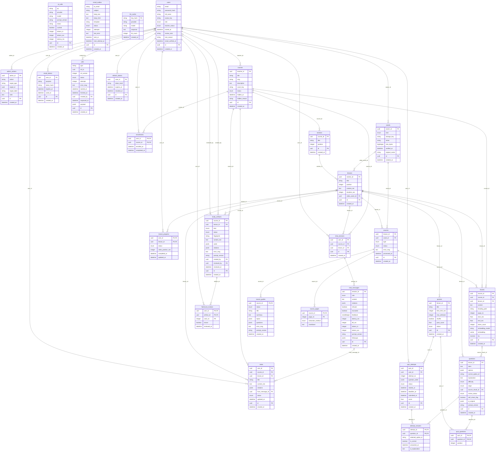

# ERD (sinh tự động, không sửa tay)

Sinh bằng `uv run python -m scripts.gen_erd` từ thư mục `backend/`. CI kiểm tra file này khớp với models.

```mermaid
erDiagram
    admin_actions {
        uuid admin_id FK
        string action
        string target_type
        uuid target_id
        string target_label
        text note
        uuid id PK
        datetime created_at
    }
    ai_calls {
        string op
        string provider
        string model
        string prompt_version
        string status
        boolean cached
        integer tokens_in
        integer tokens_out
        integer latency_ms
        uuid id PK
        datetime created_at
    }
    assets {
        uuid owner_id FK
        enum kind
        string storage_key
        string mime
        biginteger size_bytes
        datetime verified_at
        string original_name
        uuid id PK
        datetime created_at
    }
    attempt_answers {
        uuid attempt_id PK, FK
        uuid question_id PK, FK
        string selected_option_id
        boolean is_correct
        datetime answered_at
        text ai_explanation
    }
    chat_messages {
        uuid session_id FK
        enum role
        text content
        jsonb citations
        boolean refused
        boolean truncated
        smallinteger feedback
        integer latency_ms
        integer ttft_ms
        integer tokens_in
        integer tokens_out
        string prompt_version
        jsonb followups
        uuid id PK
        datetime created_at
    }
    chat_sessions {
        uuid user_id FK
        uuid course_id FK
        uuid lesson_id FK
        uuid id PK
        datetime created_at
    }
    chunks {
        uuid source_id FK
        uuid course_id FK
        uuid lesson_id FK
        text content
        string heading_path
        integer page_no
        float start_sec
        float end_sec
        integer token_count
        string embedding_model
        vector embedding
        tsvector tsv
        uuid id PK
        datetime created_at
    }
    courses {
        uuid teacher_id FK
        string title
        string slug
        text description
        string cover_key
        enum status
        datetime hidden_at
        string hidden_reason
        uuid id PK
        datetime created_at
    }
    email_outbox {
        string to_email
        string subject
        text body_text
        text body_html
        string template
        enum status
        integer attempts
        text last_error
        datetime sent_at
        datetime next_attempt_at
        uuid id PK
        datetime created_at
    }
    email_tokens {
        uuid user_id FK
        string purpose
        string token_hash
        datetime expires_at
        datetime used_at
        uuid id PK
        datetime created_at
    }
    enrollments {
        uuid user_id PK, FK
        uuid course_id PK, FK
        datetime enrolled_at
        datetime completed_at
    }
    flashcard_reviews {
        uuid user_id PK, FK
        uuid artifact_id PK, FK
        integer card_no PK
        boolean known
        datetime reviewed_at
    }
    jobs {
        string type
        uuid ref_id
        integer ref_version
        enum status
        integer attempts
        text error_msg
        datetime started_at
        datetime finished_at
        uuid created_by FK
        datetime requeued_at
        jsonb payload
        uuid id PK
        datetime created_at
    }
    lesson_progress {
        uuid user_id PK, FK
        uuid lesson_id PK, FK
        enum status
        integer video_position_sec
        datetime completed_at
        datetime updated_at
    }
    lessons {
        uuid section_id FK
        string title
        integer position
        text content_md
        integer duration_sec
        uuid video_asset_id FK
        uuid id PK
        datetime created_at
    }
    llm_cache {
        string key_hash PK
        string provider
        string model
        text response
        integer hit_count
        datetime created_at
    }
    notes {
        uuid user_id FK
        uuid course_id FK
        uuid lesson_id FK
        string title
        text content_md
        jsonb citations
        uuid from_message_id FK
        enum status
        datetime updated_at
        uuid id PK
        datetime created_at
    }
    questions {
        uuid lesson_id FK
        text stem
        jsonb options
        string correct_option_id
        text explanation
        enum difficulty
        enum origin
        uuid source_chunk_id FK
        enum review_status
        boolean self_check_flag
        jsonb ai_original
        string prompt_version
        uuid id PK
        datetime created_at
    }
    quiz_attempts {
        uuid quiz_id FK
        uuid user_id FK
        integer attempt_no
        jsonb question_order
        enum status
        datetime started_at
        datetime deadline_at
        datetime submitted_at
        float score
        uuid id PK
        datetime created_at
    }
    quiz_questions {
        uuid quiz_id PK, FK
        uuid question_id PK, FK
        integer position
    }
    quizzes {
        uuid lesson_id FK
        string title
        integer time_limit_sec
        integer max_attempts
        boolean shuffle
        float pass_score
        enum status
        uuid id PK
        datetime created_at
    }
    refresh_tokens {
        uuid user_id FK
        string token_hash
        datetime expires_at
        datetime revoked_at
        uuid id PK
        datetime created_at
    }
    sections {
        uuid course_id FK
        string title
        integer position
        uuid id PK
        datetime created_at
    }
    source_guides {
        uuid source_id PK, FK
        enum status
        string title
        text summary
        jsonb topics
        jsonb questions
        text error_msg
        string prompt_version
        datetime created_at
    }
    source_pages {
        uuid source_id PK, FK
        integer page_no PK
        enum extraction_method
        text markdown
    }
    sources {
        uuid lesson_id FK
        uuid asset_id FK
        enum type
        enum status
        text error_msg
        datetime processed_at
        uuid id PK
        datetime created_at
    }
    study_artifacts {
        uuid course_id FK
        uuid lesson_id FK
        enum kind
        enum status
        string fingerprint
        text content_md
        jsonb cards
        jsonb citations
        text error_msg
        string prompt_version
        uuid created_by FK
        uuid reviewed_by FK
        datetime reviewed_at
        uuid id PK
        datetime created_at
    }
    users {
        string email
        string password_hash
        string full_name
        string avatar_key
        enum role
        enum teacher_status
        datetime locked_at
        string review_note
        string lock_reason
        datetime email_verified_at
        uuid id PK
        datetime created_at
    }
    assets |o--o{ lessons : "video_asset_id"
    assets ||--o{ sources : "asset_id"
    chat_messages |o--o{ notes : "from_message_id"
    chat_sessions ||--o{ chat_messages : "session_id"
    chunks |o--o{ questions : "source_chunk_id"
    courses ||--o{ chat_sessions : "course_id"
    courses ||--o{ chunks : "course_id"
    courses ||--o{ enrollments : "course_id"
    courses ||--o{ notes : "course_id"
    courses ||--o{ sections : "course_id"
    courses ||--o{ study_artifacts : "course_id"
    lessons |o--o{ chat_sessions : "lesson_id"
    lessons |o--o{ notes : "lesson_id"
    lessons |o--o{ study_artifacts : "lesson_id"
    lessons ||--o{ chunks : "lesson_id"
    lessons ||--o{ lesson_progress : "lesson_id"
    lessons ||--o{ questions : "lesson_id"
    lessons ||--o{ quizzes : "lesson_id"
    lessons ||--o{ sources : "lesson_id"
    questions ||--o{ attempt_answers : "question_id"
    questions ||--o{ quiz_questions : "question_id"
    quiz_attempts ||--o{ attempt_answers : "attempt_id"
    quizzes ||--o{ quiz_attempts : "quiz_id"
    quizzes ||--o{ quiz_questions : "quiz_id"
    sections ||--o{ lessons : "section_id"
    sources ||--o{ chunks : "source_id"
    sources ||--o{ source_guides : "source_id"
    sources ||--o{ source_pages : "source_id"
    study_artifacts ||--o{ flashcard_reviews : "artifact_id"
    users |o--o{ admin_actions : "admin_id"
    users |o--o{ jobs : "created_by"
    users |o--o{ study_artifacts : "created_by"
    users |o--o{ study_artifacts : "reviewed_by"
    users ||--o{ assets : "owner_id"
    users ||--o{ chat_sessions : "user_id"
    users ||--o{ courses : "teacher_id"
    users ||--o{ email_tokens : "user_id"
    users ||--o{ enrollments : "user_id"
    users ||--o{ flashcard_reviews : "user_id"
    users ||--o{ lesson_progress : "user_id"
    users ||--o{ notes : "user_id"
    users ||--o{ quiz_attempts : "user_id"
    users ||--o{ refresh_tokens : "user_id"
```
