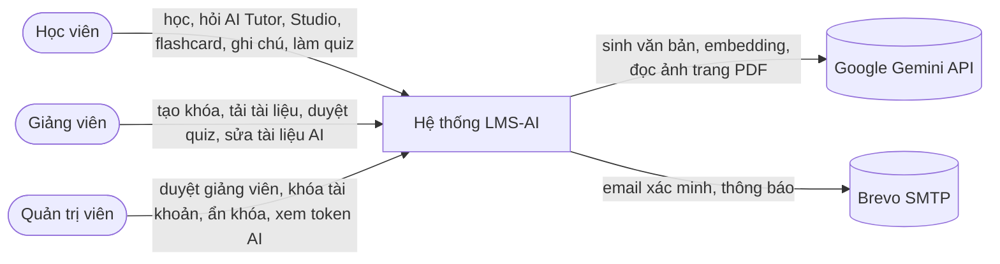
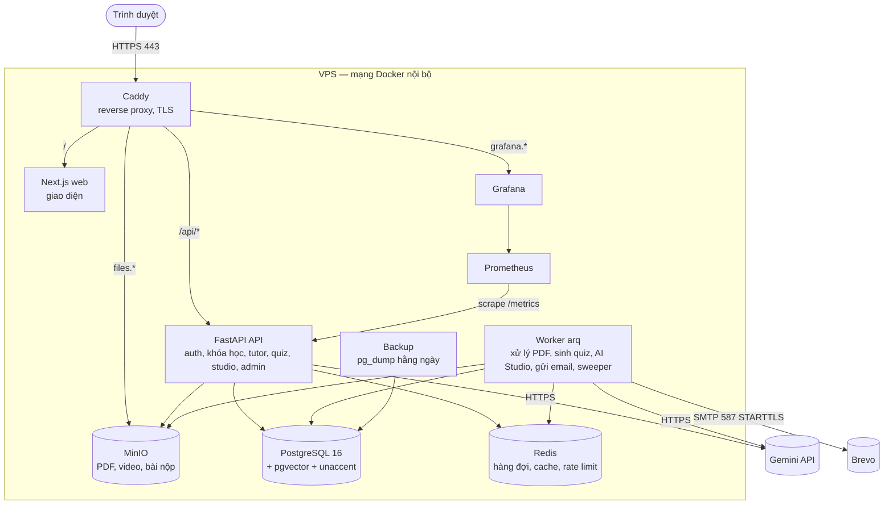
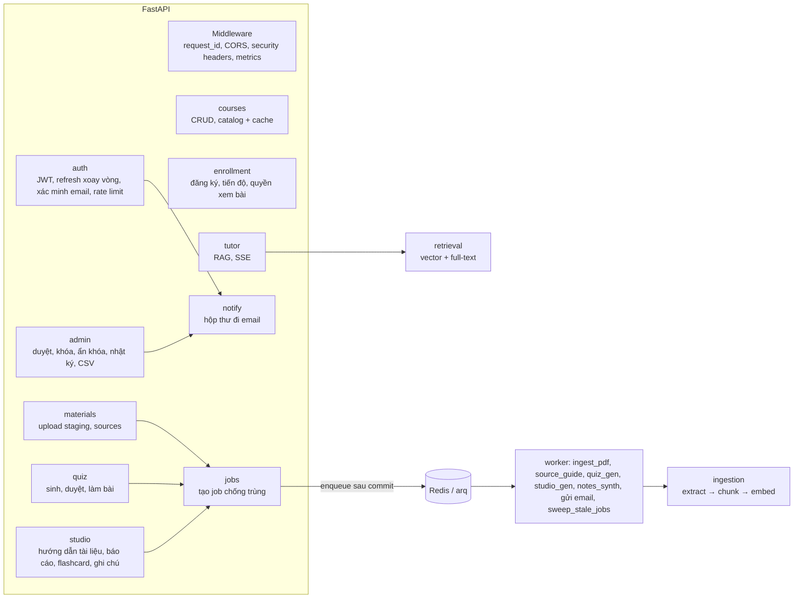
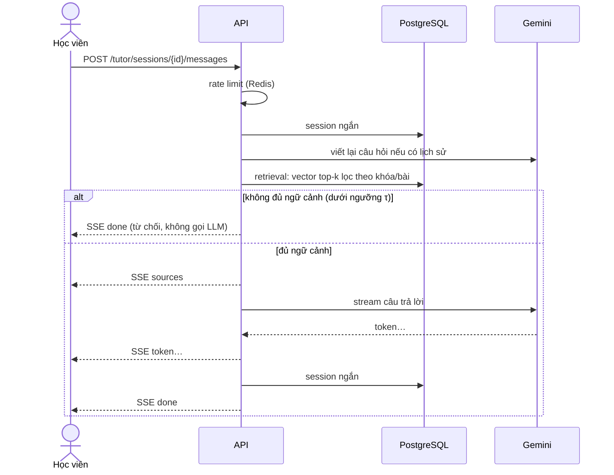
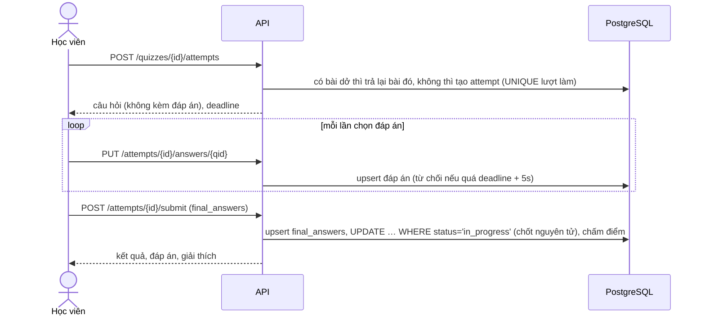
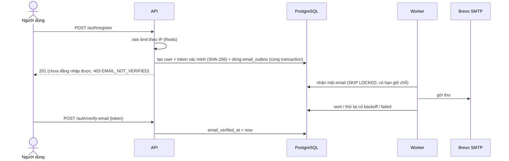

# Tầng S — Chất lượng hệ thống (S2–S7) Implementation Plan

> **For agentic workers:** REQUIRED SUB-SKILL: Use superpowers:subagent-driven-development (recommended) or superpowers:executing-plans to implement this plan task-by-task. Steps use checkbox (`- [ ]`) syntax for tracking.

**Goal:** Đưa hệ thống lên mức production. Cụ thể:

- Bảo mật HTTP: security headers và rate limit cho đăng nhập/đăng ký.
- Cache Redis cho catalog và trang chi tiết khóa học, có số liệu đo trước và sau khi cache.
- Giám sát: endpoint `/ready`, Prometheus, Grafana.
- Deploy lên VPS có HTTPS, backup và kiểm tra khôi phục, CD tự rollback khi lỗi.
- Load test bằng k6, checklist OWASP, tài liệu kiến trúc (ERD tự sinh, C4, sequence diagram).

**Architecture:**

- **Phần code backend (Task 1–8):** viết theo TDD giống tuần 1–2. Cache và rate limit đều **fail-open**: Redis lỗi thì hệ thống vẫn chạy, chỉ mất cache hoặc mất giới hạn.
- **Phần hạ tầng (Task 9–12):** dùng file compose riêng (`docker-compose.prod.yml`, project `lms-ai-prod`), chỉ Caddy mở cổng 80/443, mọi service khác nằm trong mạng nội bộ. Diễn tập trên máy trước (domain `*.localhost`), rồi mới làm trên VPS.
- **Phần đo đạc và tài liệu (Task 13–16):** sinh ra số liệu và sơ đồ cho chương 3–4 của báo cáo.

**Tech Stack:** FastAPI, redis-py (asyncio), prometheus-fastapi-instrumentator, Caddy 2, Prometheus, Grafana OSS, k6, GitHub Actions (SSH deploy), pip-audit, Mermaid.

**Spec:** `docs/specs/2026-09-29-lms-ai-design.md` (mục 0 tầng S, 3, 6, 7, 9.7, 11, 13).

> **Bản vá 08/10/2026.** Plan gốc viết ngày 30/09, trước khi có frontend, khu admin, email xác minh và AI Studio. Bản này sửa cho khớp code hiện tại. Phần backend (Task 1–8, 13, 15) đã được **chạy thử** trên bản đã xong plan admin và plan AI Studio: **706 test pass** (682 cũ + 24 mới), `ruff` sạch. Caddyfile đã được `caddy validate` và diễn tập định tuyến thật (Caddy + API + Next.js trên máy). `docker-compose.prod.yml` đã qua `docker compose config`.
>
> | # | Chỗ sửa | Vì sao |
> |---|---|---|
> | 1 | Task 2 chỉ thêm giới hạn **đăng nhập**; bỏ file `auth/ratelimit.py` | Đăng ký đã có giới hạn theo IP từ plan admin (`register-ip`, 20/giờ). Làm lại sẽ đếm hai lần. Fixture `limiter` cũng đã có sẵn |
> | 2 | Task 5 thêm xóa cache khi admin **ẩn / hiện lại** khóa | Không thì khóa bị ẩn vẫn nằm trên catalog tới 60 giây |
> | 3 | Task 7 thêm `METRICS_REFRESH_S` vào `.env.example`, sửa `noqa` thừa | `test_config` bắt mọi setting phải có trong `.env.example`; ruff báo `RUF100` |
> | 4 | Task 7 đo thêm hộp thư đi (email) và token AI | Hai thứ mới dễ hỏng / tốn tiền nhất |
> | 5 | Task 9: thêm service `web` (Next.js), Caddy chuyển `/` tới web, thêm SMTP Brevo, `APP_BASE_URL`, CORS của MinIO | Plan gốc chỉ có trang giữ chỗ, chưa gửi được email thật |
> | 6 | Mật khẩu Postgres / Redis sinh bằng `openssl rand -hex 32` | Base64 có ký tự `/`: arq đọc sai `REDIS_URL` (đã thử: `invalid literal for int()`), worker không chạy |
> | 7 | Task 13 `perf_seed`: email `@example.com`, đánh dấu đã xác minh, nạp `models_registry` | Bản cũ dùng `@lms.local` (đăng nhập từ chối), chưa xác minh (403), và lỗi `NoReferencedTableError` khi chạy |
> | 8 | Task 11 `deploy.sh` chờ cả web | Bản cũ chỉ kiểm API |
> | 9 | Task 12 runbook thêm swap, Brevo, thử email | VPS 4 GB build Next.js dễ hết RAM; email cần cấu hình người gửi |
> | 10 | Task 3 quét thêm thư viện frontend; Task 14, 15, 16 cập nhật theo tính năng mới | OWASP, sơ đồ kiến trúc và ERD phải khớp code thật |

**Điều kiện trước khi chạy plan (bắt buộc):**

1. Plan tuần 2, FE-1, FE-2, **plan admin** (`2026-10-07-admin-plan.md`) và **plan AI Studio** (`2026-10-08-ai-studio-plan.md`) đã xong. Plan này dùng lại:
   - `app/core/ratelimit.py` (`RateLimiter`, `get_rate_limiter`), fixture `limiter` trong `tests/conftest.py`, hàm `_limit` / `_ip` trong `app/modules/auth/router.py`.
   - Bảng `chat_messages` (cột `ttft_ms`, `role`), `email_outbox`, `ai_calls`, `study_artifacts`, `notes`.
   - `frontend/Dockerfile` (Next.js standalone, build arg `API_ORIGIN`).
2. CI (S1) đang xanh.

**Ngoài phạm vi:**

- Mirror dữ liệu MinIO ra ngoài VPS. Backup hiện nằm trên chính VPS; đồng bộ sang nơi khác ghi vào mục Hướng phát triển.
- Guard chặn JWT secret mặc định. Bạn đã quyết định bỏ qua; production dùng secret sinh ngẫu nhiên, xem Task 12.
- Content-Security-Policy cho trang web Next.js (cần liệt kê nguồn script / style của KaTeX, video MinIO…). Trang web chỉ có các header cơ bản (Task 9).

**Bổ sung so với spec** (cập nhật vào spec ở Task 16):

- **Endpoint mới:** `GET /api/v1/ready` (công khai, không cần token) và `GET /metrics` (chỉ gọi được trong mạng nội bộ; Caddy chặn từ bên ngoài).
- **Setting mới:** `CACHE_ENABLED`, `CACHE_TTL_S`, `LOGIN_RATE_LIMIT_PER_MIN`, `MINIO_PUBLIC_SECURE`, `METRICS_REFRESH_S`.
- **Giới hạn đăng nhập chọn rộng (20 lần / phút / IP)** vì cả lớp dùng WiFi trường thì đi chung một IP (NAT). Giới hạn chặt hơn sẽ chặn nhầm đợt dùng thử của cả lớp. Đăng ký (20 / giờ / IP) và gửi lại email xác minh đã có giới hạn từ plan admin.

---

## Cấu trúc file

```
lms-ai/
├── .github/workflows/
│   ├── ci.yml                         # (sửa) thêm job audit, kiểm tra ERD
│   └── deploy.yml                     # (mới) CD qua SSH sau khi CI xanh trên main
├── docker-compose.prod.yml            # (mới) stack production
├── .env.prod.example                  # (mới) mẫu biến môi trường production (file thật .env.prod không commit)
├── infra/
│   ├── prod.sh                        # docker compose -f docker-compose.prod.yml --env-file .env.prod "$@"
│   ├── caddy/Caddyfile
│   ├── prometheus/prometheus.yml
│   ├── grafana/provisioning/{datasources,dashboards}/*.yml
│   ├── grafana/dashboards/lms-overview.json
│   ├── backup/{backup-loop.sh,backup.sh,restore-check.sh}
│   └── deploy/deploy.sh               # chạy trên VPS: checkout sha → up → chờ ready → rollback nếu lỗi
├── perf/
│   ├── k6/{catalog.js,learner.js}
│   └── results/                       # file json kết quả k6 (commit để làm bằng chứng)
├── docs/
│   ├── architecture/{README.md,erd.md}
│   ├── security/owasp-top10.md
│   ├── ops/runbook.md
│   └── perf/report.md
└── backend/
    ├── app/core/{cache.py,health.py,metrics.py}   # (mới)
    ├── app/core/middleware.py         # (sửa) SecurityHeadersMiddleware
    ├── app/core/storage.py            # (sửa) ping(), MINIO_PUBLIC_SECURE
    ├── app/core/config.py             # (sửa) setting mới
    ├── app/modules/auth/router.py     # (sửa) giới hạn đăng nhập theo IP
    ├── app/modules/courses/service.py # (sửa) cache catalog/chi tiết, xóa cache khi dữ liệu đổi
    ├── app/main.py                    # (sửa) middleware, router health, metrics, lifespan
    ├── app/modules/admin/service.py   # (sửa) xóa cache khi ẩn / hiện lại khóa
    ├── scripts/{perf_seed.py,gen_erd.py}
    └── tests/test_{security_headers,auth_ratelimit,cache,course_cache,ready,metrics}.py
```

---

### Task 1: Security headers cho mọi response API

**Files:**
- Modify: `backend/app/core/middleware.py`, `backend/app/main.py`
- Test: `backend/tests/test_security_headers.py`

- [x] **Step 1: Viết test hỏng trước — `tests/test_security_headers.py`**

```python
async def test_api_responses_have_security_headers(client):
    r = await client.get("/api/v1/health")
    assert r.headers["x-content-type-options"] == "nosniff"
    assert r.headers["x-frame-options"] == "DENY"
    assert r.headers["referrer-policy"] == "strict-origin-when-cross-origin"
    assert "default-src 'none'" in r.headers["content-security-policy"]


async def test_error_responses_also_have_security_headers(client):
    r = await client.get("/api/v1/khong-ton-tai")
    assert r.status_code == 404
    assert r.headers["x-content-type-options"] == "nosniff"


async def test_swagger_docs_are_not_blocked_by_api_csp(client):
    # Swagger UI tải JS/CSS từ CDN, nên CSP "default-src 'none'" sẽ làm trang trắng
    r = await client.get("/docs")
    assert r.status_code == 200
    assert "content-security-policy" not in r.headers
```

- [x] **Step 2: Chạy test**

Run: `uv run pytest tests/test_security_headers.py -v`
Expected: FAIL với `KeyError: 'x-content-type-options'`

- [x] **Step 3: Thêm vào cuối `app/core/middleware.py`**

```python
_SECURITY_HEADERS: list[tuple[bytes, bytes]] = [
    (b"x-content-type-options", b"nosniff"),
    (b"x-frame-options", b"DENY"),
    (b"referrer-policy", b"strict-origin-when-cross-origin"),
    (b"permissions-policy", b"camera=(), microphone=(), geolocation=()"),
]
# API chỉ trả JSON nên không cần tải bất kỳ tài nguyên nào; chặn luôn việc bị nhúng vào iframe
_API_CSP = (b"content-security-policy", b"default-src 'none'; frame-ancestors 'none'")
_DOCS_PREFIXES = ("/docs", "/redoc", "/openapi.json")


class SecurityHeadersMiddleware:
    """Thêm security headers vào mọi response HTTP, kể cả lỗi 404/500.

    Đặt ngoài cùng (add_middleware sau cùng) để bọc cả response 500 do RequestIdMiddleware tạo.
    HSTS do Caddy gắn ở production (Task 9), vì chỉ có ý nghĩa khi chạy HTTPS.
    """

    def __init__(self, app):
        self.app = app

    async def __call__(self, scope, receive, send):
        if scope["type"] != "http":
            await self.app(scope, receive, send)
            return
        extra = list(_SECURITY_HEADERS)
        if not scope["path"].startswith(_DOCS_PREFIXES):
            extra.append(_API_CSP)

        async def send_with_headers(message):
            if message["type"] == "http.response.start":
                headers = message.setdefault("headers", [])
                existing = {k.lower() for k, _ in headers}
                headers.extend((k, v) for k, v in extra if k not in existing)
            await send(message)

        await self.app(scope, receive, send_with_headers)
```

- [x] **Step 4: Gắn middleware vào `app/main.py`**
  - Sửa dòng import thành: `from app.core.middleware import RequestIdMiddleware, SecurityHeadersMiddleware, StrictCORSMiddleware`
  - Thêm ngay **sau** khối `app.add_middleware(StrictCORSMiddleware, ...)`, trước `register_error_handlers(app)`:

```python
    # Thêm sau cùng = lớp ngoài cùng: bọc cả response CORS preflight và 500
    app.add_middleware(SecurityHeadersMiddleware)
```

- [x] **Step 5: Chạy toàn bộ test**

Run: `uv run pytest -q`
Expected: PASS hết

- [x] **Step 6: Commit**

```bash
git add backend && git commit -m "feat(security): security headers middleware for all API responses"
```

---

### Task 2: Rate limit cho đăng nhập theo IP

**Files:**
- Modify: `backend/app/core/config.py`, `backend/.env.example`, `backend/app/modules/auth/router.py`
- Test: `backend/tests/test_auth_ratelimit.py`

Đăng ký và gửi lại email xác minh **đã có** giới hạn theo IP từ plan admin (`register-ip`, `verify-resend-ip` trong `auth/router.py`). Task này chỉ thêm đăng nhập, dùng lại `_limit`, `_ip`, `_too_many` sẵn có. Fixture `limiter` (rate limiter giả, mới cho mỗi test) cũng đã có trong `tests/conftest.py`.

- [x] **Step 1: Setting**: thêm vào `Settings` trong `app/core/config.py`, ngay dưới `tutor_rate_limit_per_hour`:

```python
    # Đếm cả lần sai mật khẩu. Rộng tay vì cả lớp dùng chung một IP khi ở WiFi trường (NAT)
    login_rate_limit_per_min: int = 20
```

Thêm vào cuối `backend/.env.example`: `LOGIN_RATE_LIMIT_PER_MIN=20`

- [x] **Step 2: Viết test hỏng trước — `tests/test_auth_ratelimit.py`**

```python
from app.core.config import get_settings
from tests.helpers import API, register_user


async def test_login_is_rate_limited_per_ip(client, limiter):
    await register_user(client, "rl@x.com")
    body = {"email": "rl@x.com", "password": "password123"}
    for _ in range(get_settings().login_rate_limit_per_min):
        assert (await client.post(f"{API}/auth/login", json=body)).status_code == 200
    r = await client.post(f"{API}/auth/login", json=body)
    assert r.status_code == 429
    assert r.json()["error"]["code"] == "RATE_LIMITED"
    assert int(r.headers["retry-after"]) > 0
    assert any(k.startswith("login-ip:") for k in limiter.counts)


async def test_wrong_password_attempts_also_count(client):
    await register_user(client, "rl2@x.com")
    bad = {"email": "rl2@x.com", "password": "saimatkhau1"}
    for _ in range(get_settings().login_rate_limit_per_min):
        assert (await client.post(f"{API}/auth/login", json=bad)).status_code == 401
    r = await client.post(f"{API}/auth/login", json=bad)
    assert r.status_code == 429
```

`register_user` mặc định đánh dấu đã xác minh email, nên đăng nhập trả 200 chứ không phải 403.

- [x] **Step 3: Chạy test**

Run: `uv run pytest tests/test_auth_ratelimit.py -v`
Expected: FAIL (lần đăng nhập thứ 21 vẫn trả 200)

- [x] **Step 4: Sửa `app/modules/auth/router.py`**
  - Hàm `_limit` nhận thêm cửa sổ thời gian:

```python
async def _limit(limiter: RateLimiter, key: str, limit: int, window_s: int = 3600) -> None:
    wait = await limiter.hit(key, limit, window_s)
    if wait is not None:
        raise _too_many(wait)
```

  - Thay route đăng nhập bằng:

```python
@router.post("/auth/login", response_model=TokenOut)
async def login(
    data: LoginIn,
    request: Request,
    response: Response,
    db: AsyncSession = Depends(get_db),
    limiter: RateLimiter = Depends(get_rate_limiter),
):
    """429 RATE_LIMITED khi một IP gọi quá LOGIN_RATE_LIMIT_PER_MIN lần / phút (tính cả lần sai mật khẩu)."""
    await _limit(limiter, f"login-ip:{_ip(request)}", get_settings().login_rate_limit_per_min, 60)
    access, raw = await service.login(db, data)
    set_refresh_cookie(response, raw)
    return TokenOut(access_token=access)
```

Giới hạn chạy **trước** khi kiểm mật khẩu, nên lần đăng nhập sai cũng bị đếm. Đây chính là điều cần để chống dò mật khẩu. `_ip()` đọc `request.client.host`: ở production uvicorn chạy `--proxy-headers` sau Caddy nên đây là IP thật (Task 9).

- [x] **Step 5: Chạy toàn bộ test**

Run: `uv run pytest -q`
Expected: PASS hết

- [x] **Step 6: Commit**

```bash
git add backend && git commit -m "feat(security): per-IP rate limit on login"
```

---

### Task 3: Quét lỗ hổng thư viện trong CI (pip-audit)

**Files:**
- Modify: `.github/workflows/ci.yml`

- [x] **Step 1: Chạy thử trên máy**

Run (từ `backend/`):
```bash
uv export --frozen --no-dev --no-hashes --no-emit-project --format requirements-txt -o ../.audit-req.txt
uvx pip-audit -r ../.audit-req.txt
```
Expected: `No known vulnerabilities found`.

Nếu có lỗ hổng:
  1. Thử nâng thư viện: `uv lock --upgrade-package <tên>`, rồi chạy lại toàn bộ pytest.
  2. Nếu chưa có bản vá, thêm `--ignore-vuln <ID>` vào lệnh ở Step 2 **kèm comment lý do**, và ghi vào `docs/security/owasp-top10.md` (Task 14), mục A06.

Xóa file tạm: `rm ../.audit-req.txt`.

- [x] **Step 2: Thêm job `audit` vào `.github/workflows/ci.yml`** (ngang hàng với `lint`, `test`, `docker`)

```yaml
  audit:
    runs-on: ubuntu-latest
    steps:
      - uses: actions/checkout@v4
      - uses: astral-sh/setup-uv@v6
        with:
          version: "0.12.20"
      - name: Xuất danh sách thư viện production
        run: uv export --frozen --no-dev --no-hashes --no-emit-project --format requirements-txt -o /tmp/req.txt
      - name: Quét lỗ hổng đã công bố (OSV/PyPI advisory)
        run: uvx pip-audit -r /tmp/req.txt
      - name: Quét lỗ hổng thư viện frontend (chỉ thư viện chạy production, mức high trở lên)
        working-directory: frontend
        run: npm audit --omit=dev --audit-level=high
```

Nếu `npm audit` báo lỗi: xem thư viện nào, nâng đúng thư viện đó (`npm install <tên>@<bản vá>`) rồi chạy lại `npm test` và E2E. **Không dùng `npm audit fix --force`** (nó tự nâng bản chính, dễ làm hỏng Next.js).

- [x] **Step 3: Commit, push và kiểm tra**

```bash
git add .github/workflows/ci.yml && git commit -m "ci: dependency vulnerability audit with pip-audit"
git push
```
Expected: trên tab Actions của GitHub, job `audit` xanh.

---

### Task 4: Module cache Redis có phiên bản (fail-open)

**Files:**
- Create: `backend/app/core/cache.py`
- Modify: `backend/app/core/config.py`, `backend/.env.example`, `backend/tests/conftest.py`
- Test: `backend/tests/test_cache.py`

**Thiết kế:**

- Mỗi namespace (ví dụ `courses`) có một số phiên bản lưu ở `cache:ver:<ns>`.
- Key dữ liệu có dạng `cache:<ns>:v<ver>:<key>`.
- `bump(ns)` tăng phiên bản. Mọi key cũ lập tức bị bỏ qua và tự hết hạn theo TTL, nên không cần quét để xóa từng key.
- `get_or_load` đọc phiên bản **trước khi** chạy hàm load, và ghi kết quả vào đúng phiên bản đó. Nhờ vậy, nếu có người sửa dữ liệu (tức là bump) trong lúc đang load, dữ liệu cũ vừa load sẽ rơi vào phiên bản cũ và không làm bẩn phiên bản mới.

- [x] **Step 1: Setting**: thêm vào `Settings`:

```python
    cache_enabled: bool = True
    cache_ttl_s: int = 60
```

Thêm vào cuối `.env.example`:

```
CACHE_ENABLED=true
CACHE_TTL_S=60
```

Thêm vào khối `os.environ[...]` ở đầu `tests/conftest.py`, cạnh `DB_NULL_POOL`:

```python
os.environ["CACHE_ENABLED"] = "false"  # test mặc định không dùng cache; test cache tự bật (Task 4, 5)
```

- [x] **Step 2: Viết test hỏng trước — `tests/test_cache.py`** (cần Redis của docker compose; CI đã có service redis)

```python
import uuid

from app.core.cache import NullCache, RedisCache
from app.core.config import get_settings


def _cache() -> RedisCache:
    return RedisCache.from_url(get_settings().redis_url, prefix=f"test-{uuid.uuid4().hex}")


def _counting_loader(calls: list, cacheable: bool = True):
    async def loader():
        calls.append(1)
        return {"n": len(calls)}, cacheable

    return loader


async def test_get_or_load_serves_second_call_from_cache():
    c, calls = _cache(), []
    try:
        assert await c.get_or_load("ns", "k", 60, _counting_loader(calls)) == {"n": 1}
        assert await c.get_or_load("ns", "k", 60, _counting_loader(calls)) == {"n": 1}
        assert len(calls) == 1
    finally:
        await c.aclose()


async def test_bump_invalidates_namespace_only():
    c, calls, other = _cache(), [], []
    try:
        await c.get_or_load("ns", "k", 60, _counting_loader(calls))
        await c.get_or_load("khac", "k", 60, _counting_loader(other))
        await c.bump("ns")
        await c.get_or_load("ns", "k", 60, _counting_loader(calls))
        await c.get_or_load("khac", "k", 60, _counting_loader(other))
        assert (len(calls), len(other)) == (2, 1)
    finally:
        await c.aclose()


async def test_not_cacheable_results_are_not_stored():
    c, calls = _cache(), []
    try:
        await c.get_or_load("ns", "k", 60, _counting_loader(calls, cacheable=False))
        await c.get_or_load("ns", "k", 60, _counting_loader(calls, cacheable=False))
        assert len(calls) == 2
    finally:
        await c.aclose()


async def test_load_racing_with_bump_does_not_poison_new_version():
    c = _cache()
    try:

        async def stale_loader():
            await c.bump("ns")  # giả lập: giảng viên sửa khóa đúng lúc đang đọc DB
            return {"v": "cu"}, True

        async def fresh_loader():
            return {"v": "moi"}, True

        assert await c.get_or_load("ns", "k", 60, stale_loader) == {"v": "cu"}
        assert await c.get_or_load("ns", "k", 60, fresh_loader) == {"v": "moi"}
    finally:
        await c.aclose()


async def test_redis_down_falls_back_to_loader():
    c, calls = RedisCache.from_url("redis://127.0.0.1:1/0"), []
    try:
        assert await c.get_or_load("ns", "k", 60, _counting_loader(calls)) == {"n": 1}
        await c.bump("ns")  # không ném lỗi
    finally:
        await c.aclose()


async def test_null_cache_always_loads():
    c, calls = NullCache(), []
    await c.get_or_load("ns", "k", 60, _counting_loader(calls))
    await c.get_or_load("ns", "k", 60, _counting_loader(calls))
    assert len(calls) == 2
```

- [x] **Step 3: Chạy test**

Run: `uv run pytest tests/test_cache.py -v`
Expected: FAIL với `ModuleNotFoundError: No module named 'app.core.cache'`

- [x] **Step 4: `app/core/cache.py`**

```python
"""Cache JSON trên Redis theo namespace có phiên bản (spec tầng S5).

Fail-open: Redis lỗi thì đọc thẳng DB (chậm hơn nhưng đúng). bump() lỗi thì dữ liệu cũ
còn tồn tại tối đa TTL giây, chấp nhận được với catalog.
"""

import json
import logging
from collections.abc import Awaitable, Callable
from functools import lru_cache
from typing import Any, Protocol

from redis.asyncio import Redis
from redis.exceptions import RedisError

from app.core.config import get_settings

logger = logging.getLogger(__name__)

COURSES_NS = "courses"

Loader = Callable[[], Awaitable[tuple[Any, bool]]]  # trả (giá_trị_JSON_được, có_nên_cache)


class Cache(Protocol):
    async def get_or_load(self, ns: str, key: str, ttl_s: int, loader: Loader) -> Any: ...
    async def bump(self, ns: str) -> None: ...


class NullCache:
    async def get_or_load(self, ns: str, key: str, ttl_s: int, loader: Loader) -> Any:
        value, _ = await loader()
        return value

    async def bump(self, ns: str) -> None:
        return None


class RedisCache:
    def __init__(self, redis: Redis, prefix: str = "cache"):
        self._redis = redis
        self._prefix = prefix

    @classmethod
    def from_url(cls, url: str, prefix: str = "cache") -> "RedisCache":
        # Timeout ngắn: cache chậm thì bỏ qua, không được làm chậm request
        return cls(Redis.from_url(url, socket_timeout=0.5, socket_connect_timeout=0.5), prefix)

    def _ver_key(self, ns: str) -> str:
        return f"{self._prefix}:ver:{ns}"

    async def get_or_load(self, ns: str, key: str, ttl_s: int, loader: Loader) -> Any:
        try:
            ver = int(await self._redis.get(self._ver_key(ns)) or 0)
            full_key = f"{self._prefix}:{ns}:v{ver}:{key}"
            raw = await self._redis.get(full_key)
        except RedisError:
            logger.warning("Cache: không đọc được Redis (%s/%s), đọc thẳng DB", ns, key)
            value, _ = await loader()
            return value
        if raw is not None:
            return json.loads(raw)
        value, cacheable = await loader()
        if cacheable:
            try:
                await self._redis.set(full_key, json.dumps(value, ensure_ascii=False), ex=ttl_s)
            except RedisError:
                logger.warning("Cache: không ghi được Redis (%s/%s)", ns, key)
        return value

    async def bump(self, ns: str) -> None:
        try:
            await self._redis.incr(self._ver_key(ns))
        except RedisError:
            logger.warning("Cache: không tăng được phiên bản %s, dữ liệu cũ tồn tại tối đa TTL", ns)

    async def aclose(self) -> None:
        await self._redis.aclose()


@lru_cache
def get_cache() -> Cache:
    s = get_settings()
    if not s.cache_enabled:
        return NullCache()
    return RedisCache.from_url(s.redis_url)
```

- [x] **Step 5: Chạy test**

Run: `uv run pytest tests/test_cache.py -v`
Expected: PASS cả 6 test

- [x] **Step 6: Commit**

```bash
git add backend && git commit -m "feat(cache): versioned Redis JSON cache with fail-open and race-safe invalidation"
```

---

### Task 5: Cache catalog và trang chi tiết khóa học

**Files:**
- Modify: `backend/app/modules/courses/service.py`, `backend/app/modules/courses/router.py`, `backend/app/modules/admin/service.py`
- Test: `backend/tests/test_course_cache.py`

**Quy tắc:**

- Catalog được cache theo `(q, page, size)`.
- Trang chi tiết cache **phần chung** của khóa (thông tin khóa và mục lục), **chỉ khi khóa đã publish**. Hai cờ `is_enrolled` và `is_owner` luôn được tính lại cho từng người, nên cùng một bản cache dùng được cho mọi người xem.
- Mọi thao tác thay đổi khóa, chương hoặc bài học đều gọi `bump(COURSES_NS)`, **kể cả khi admin ẩn / hiện lại khóa**.

- [x] **Step 1: Viết test hỏng trước — `tests/test_course_cache.py`**

```python
import uuid

import pytest
from sqlalchemy import update

from app.core import cache as cache_mod
from app.core.cache import RedisCache
from app.core.config import get_settings
from app.modules.courses.models import Course
from tests.helpers import (
    API,
    add_lesson,
    create_course,
    make_admin,
    make_published_course,
    make_student,
    make_teacher,
)


@pytest.fixture
async def redis_cache(monkeypatch):
    c = RedisCache.from_url(get_settings().redis_url, prefix=f"test-{uuid.uuid4().hex}")
    monkeypatch.setattr(cache_mod, "get_cache", lambda: c)
    yield c
    await c.aclose()


async def _titles(client) -> list[str]:
    return [c["title"] for c in (await client.get(f"{API}/courses")).json()["items"]]


async def test_catalog_served_from_cache_until_course_changes(client, db, redis_cache):
    _, gv = await make_teacher(client)
    course, _, _ = await make_published_course(client, gv, title="Cấu trúc dữ liệu")
    assert await _titles(client) == ["Cấu trúc dữ liệu"]

    # Sửa thẳng DB (không qua service nên không bump) → vẫn thấy bản cache: chứng minh có cache
    await db.execute(update(Course).where(Course.id == uuid.UUID(course["id"])).values(title="Đổi ngầm"))
    await db.commit()
    assert await _titles(client) == ["Cấu trúc dữ liệu"]

    # Sửa qua API → service bump → thấy bản mới ngay
    r = await client.patch(f"{API}/courses/{course['id']}", json={"title": "Giải thuật nâng cao"}, headers=gv)
    assert r.status_code == 200
    assert await _titles(client) == ["Giải thuật nâng cao"]


async def test_detail_cache_keeps_per_user_flags(client, redis_cache):
    _, gv = await make_teacher(client)
    _, sv = await make_student(client)
    course, _, _ = await make_published_course(client, gv)
    await client.post(f"{API}/courses/{course['id']}/enroll", headers=sv)
    url = f"{API}/courses/{course['slug']}"

    anon = (await client.get(url)).json()
    student = (await client.get(url, headers=sv)).json()
    owner = (await client.get(url, headers=gv)).json()
    assert (anon["is_enrolled"], anon["is_owner"]) == (False, False)
    assert (student["is_enrolled"], student["is_owner"]) == (True, False)
    assert owner["is_owner"] is True


async def test_draft_detail_is_not_cached_and_stays_private(client, redis_cache):
    _, gv = await make_teacher(client)
    draft = await create_course(client, gv)
    url = f"{API}/courses/{draft['slug']}"
    assert (await client.get(url, headers=gv)).status_code == 200
    assert (await client.get(url)).status_code == 404  # bản giáo viên vừa xem không bị cache cho khách


async def test_adding_lesson_invalidates_detail(client, redis_cache):
    _, gv = await make_teacher(client)
    course, section, _ = await make_published_course(client, gv)
    url = f"{API}/courses/{course['slug']}"
    assert len((await client.get(url)).json()["sections"][0]["lessons"]) == 1
    await add_lesson(client, gv, section["id"], "Bài 2")
    assert len((await client.get(url)).json()["sections"][0]["lessons"]) == 2


async def test_admin_hide_and_unhide_take_effect_immediately(client, redis_cache):
    _, gv = await make_teacher(client)
    _, ad = await make_admin(client)
    course, _, _ = await make_published_course(client, gv, title="Khóa vi phạm")
    url = f"{API}/courses/{course['slug']}"
    assert await _titles(client) == ["Khóa vi phạm"]
    assert (await client.get(url)).status_code == 200  # đã nằm trong cache

    r = await client.post(f"{API}/admin/courses/{course['id']}/hide", json={"reason": "Vi phạm"}, headers=ad)
    assert r.status_code == 200
    assert await _titles(client) == []
    assert (await client.get(url)).status_code == 404
    owner = (await client.get(url, headers=gv)).json()
    assert owner["hidden_reason"] == "Vi phạm"

    assert (await client.post(f"{API}/admin/courses/{course['id']}/unhide", headers=ad)).status_code == 200
    assert await _titles(client) == ["Khóa vi phạm"]
```

- [x] **Step 2: Chạy test**

Run: `uv run pytest tests/test_course_cache.py -v`
Expected: `test_catalog_served_from_cache_until_course_changes` FAIL (thấy "Đổi ngầm" vì chưa có cache). Riêng `test_admin_hide_and_unhide_take_effect_immediately` chỉ fail sau Step 3 nếu quên Step 4b. Các test còn lại có thể PASS ngay, vì chúng chỉ canh để không làm hỏng hành vi hiện có.

- [x] **Step 3: Sửa `app/modules/courses/service.py`**

Thêm import ở đầu file:

```python
from app.core import cache as cache_mod
from app.core.cache import COURSES_NS
from app.core.config import get_settings
```

Thêm hàm này ngay trên `def make_slug` (không có `_` ở đầu vì `admin/service.py` cũng gọi):

```python
async def invalidate_courses_cache() -> None:
    """Gọi sau mọi commit làm đổi dữ liệu hiển thị trên catalog/chi tiết khóa."""
    await cache_mod.get_cache().bump(COURSES_NS)
```

Thêm dòng `await invalidate_courses_cache()` ngay **sau** `await db.commit()` trong **đúng 10 hàm** sau:

- `update_course`, `delete_course`, `publish_course`
- `add_section`, `update_section`, `delete_section`
- `add_lesson`, `update_lesson`, `delete_lesson`
- `reorder`

(`create_course` không cần: khóa mới luôn ở trạng thái nháp, chưa xuất hiện trên catalog.)

Thêm hàm sau ngay dưới `list_published`:

```python
async def list_published_cached(db: AsyncSession, q: str | None, params: PageParams) -> CoursePage:
    key = f"catalog:{(q or '').strip().lower()[:100]}:{params.page}:{params.size}"

    async def load():
        page = await list_published(db, q, params)
        return page.model_dump(mode="json"), True

    data = await cache_mod.get_cache().get_or_load(COURSES_NS, key, get_settings().cache_ttl_s, load)
    return CoursePage.model_validate(data)
```

Thay **toàn bộ** hàm `get_course_detail` bằng 2 hàm sau:

```python
async def _load_detail_base(db: AsyncSession, slug: str) -> dict:
    """Phần giống nhau với mọi người xem (thông tin khóa và mục lục), dạng JSON để cache được."""
    course = await db.scalar(
        select(Course)
        .where(Course.slug == slug)
        .options(selectinload(Course.sections).selectinload(Section.lessons))
    )
    if course is None:
        raise not_found("Khóa học")
    teacher_name = await db.scalar(select(User.full_name).where(User.id == course.teacher_id))
    return {
        **CourseOut.model_validate(course).model_dump(mode="json"),
        "teacher_name": teacher_name,
        "sections": [SectionBrief.model_validate(s).model_dump(mode="json") for s in course.sections],
    }


async def get_course_detail(db: AsyncSession, slug: str, user: User | None) -> CourseDetail:
    from app.modules.enrollment.service import is_enrolled  # import trong hàm để tránh vòng import

    async def load():
        base = await _load_detail_base(db, slug)
        # Chỉ cache khóa đã publish: bản nháp / bị ẩn chỉ chủ khóa xem, không được lọt ra cho người khác
        return base, base["status"] == CourseStatus.published.value

    base = await cache_mod.get_cache().get_or_load(
        COURSES_NS, f"detail:{slug}", get_settings().cache_ttl_s, load
    )
    teacher_id, course_id = uuid.UUID(base["teacher_id"]), uuid.UUID(base["id"])
    is_owner = user is not None and (user.role == Role.admin or teacher_id == user.id)
    if base["status"] != CourseStatus.published.value and not is_owner:
        raise not_found("Khóa học")
    enrolled = user is not None and await is_enrolled(db, user.id, course_id)
    return CourseDetail.model_validate({**base, "is_enrolled": enrolled, "is_owner": is_owner})
```

- [x] **Step 4: Router dùng bản có cache** (`app/modules/courses/router.py`): trong hàm `catalog`, đổi lời gọi `service.list_published(...)` thành `service.list_published_cached(...)`, giữ nguyên tham số.

- [x] **Step 4b: Admin ẩn / hiện lại khóa cũng xóa cache** (`app/modules/admin/service.py`)
  - Import: `from app.modules.courses.service import invalidate_courses_cache` (đặt ngay dưới dòng import `app.modules.courses.models`).
  - Trong `hide_course` và `unhide_course`, thêm ngay **sau** `await db.commit()`:

```python
    await invalidate_courses_cache()  # khóa vào / ra khỏi catalog ngay, không chờ hết TTL
```

- [x] **Step 5: Chạy toàn bộ test**

Run: `uv run pytest -q`
Expected: PASS hết. Các test catalog cũ chạy với `NullCache` (vì `CACHE_ENABLED=false`) nên không bị cache giữa các test.

- [x] **Step 6: Commit**

```bash
git add backend && git commit -m "perf(courses): cache catalog and course detail in Redis with version-bump invalidation"
```

---

### Task 6: Endpoint `/ready` (DB, Redis, MinIO)

**Files:**
- Create: `backend/app/core/health.py`
- Modify: `backend/app/core/storage.py`, `backend/tests/fakes.py`, `backend/app/main.py`
- Test: `backend/tests/test_ready.py`

- [x] **Step 1: Thêm `ping` cho storage**
  - Trong `app/core/storage.py`:
    - Thêm vào `class Storage(Protocol)`: `async def ping(self) -> None: ...`
    - Thêm vào `class MinioStorage`, ngay dưới `ensure_bucket`:

```python
    async def ping(self) -> None:
        """Cho /ready: gọi MinIO thật (bucket_exists), lỗi mạng hoặc sai khóa sẽ ném exception."""
        await asyncio.to_thread(self._internal.bucket_exists, self._bucket)
```

  - Trong `tests/fakes.py`, thêm vào `class InMemoryStorage`:

```python
    fail_ping = False

    async def ping(self):
        if self.fail_ping:
            raise ConnectionError("minio giả bị tắt")
```

- [x] **Step 2: Viết test hỏng trước — `tests/test_ready.py`**

```python
import httpx

from app.core.health import get_redis_ping
from app.core.storage import get_storage
from app.main import create_app
from tests.fakes import InMemoryStorage


def _client(storage, redis_ok=True):
    app = create_app()
    app.dependency_overrides[get_storage] = lambda: storage

    async def redis_ping():
        if not redis_ok:
            raise ConnectionError("redis giả bị tắt")

    app.dependency_overrides[get_redis_ping] = lambda: redis_ping
    return httpx.AsyncClient(transport=httpx.ASGITransport(app=app), base_url="http://test")


async def test_ready_when_all_dependencies_up():
    async with _client(InMemoryStorage()) as c:
        r = await c.get("/api/v1/ready")
    assert r.status_code == 200
    assert r.json() == {"status": "ready", "checks": {"db": "ok", "redis": "ok", "storage": "ok"}}


async def test_not_ready_reports_failing_dependency():
    storage = InMemoryStorage()
    storage.fail_ping = True
    async with _client(storage, redis_ok=False) as c:
        r = await c.get("/api/v1/ready")
    assert r.status_code == 503
    body = r.json()
    assert body["status"] == "not_ready"
    assert body["checks"]["db"] == "ok"
    assert body["checks"]["redis"].startswith("error")
    assert body["checks"]["storage"].startswith("error")


async def test_ready_uses_real_redis_by_default(client):
    r = await client.get("/api/v1/ready")  # fixture client: storage giả, Redis thật của compose/CI
    assert r.json()["checks"]["redis"] == "ok"
```

- [x] **Step 3: Chạy test**

Run: `uv run pytest tests/test_ready.py -v`
Expected: FAIL với `ModuleNotFoundError: No module named 'app.core.health'`

- [x] **Step 4: `app/core/health.py`**

```python
"""Readiness: service có dùng được không (khác /health chỉ báo tiến trình còn sống)."""

import asyncio
from collections.abc import Awaitable, Callable

from fastapi import APIRouter, Depends
from fastapi.responses import JSONResponse
from redis.asyncio import Redis
from sqlalchemy import text
from sqlalchemy.ext.asyncio import AsyncSession

from app.core.config import get_settings
from app.core.db import get_db
from app.core.storage import Storage, get_storage

router = APIRouter(prefix="/api/v1", tags=["health"])

CHECK_TIMEOUT_S = 2.0
RedisPing = Callable[[], Awaitable[None]]


def get_redis_ping() -> RedisPing:
    async def ping() -> None:
        r = Redis.from_url(get_settings().redis_url, socket_timeout=1, socket_connect_timeout=1)
        try:
            await r.ping()
        finally:
            await r.aclose()

    return ping


@router.get("/ready")
async def ready(
    db: AsyncSession = Depends(get_db),
    storage: Storage = Depends(get_storage),
    redis_ping: RedisPing = Depends(get_redis_ping),
) -> JSONResponse:
    async def check_db() -> None:
        await db.execute(text("SELECT 1"))

    checks: dict[str, str] = {}
    for name, fn in (("db", check_db), ("redis", redis_ping), ("storage", storage.ping)):
        try:
            await asyncio.wait_for(fn(), timeout=CHECK_TIMEOUT_S)
            checks[name] = "ok"
        except Exception as e:  # noqa: BLE001 — mọi lỗi đều nghĩa là chưa sẵn sàng
            checks[name] = f"error: {type(e).__name__}"
    ok = all(v == "ok" for v in checks.values())
    return JSONResponse(
        {"status": "ready" if ok else "not_ready", "checks": checks}, status_code=200 if ok else 503
    )
```

(Chỉ trả **tên loại lỗi**, không trả nội dung lỗi, để không lộ host hay mật khẩu trong chuỗi kết nối.)

- [x] **Step 5: Gắn router** (`app/main.py`)
  - Import: `from app.core.health import router as health_router`
  - Dưới `# routers`: `app.include_router(health_router)`

- [x] **Step 6: Chạy toàn bộ test**

Run: `uv run pytest -q`
Expected: PASS hết

- [x] **Step 7: Commit**

```bash
git add backend && git commit -m "feat(ops): readiness endpoint checking db, redis and object storage"
```

---

### Task 7: Metrics Prometheus (HTTP và nghiệp vụ)

**Files:**
- Create: `backend/app/core/metrics.py`
- Modify: `backend/pyproject.toml` (qua `uv add`), `backend/app/core/config.py`, `backend/app/main.py`
- Test: `backend/tests/test_metrics.py`

- [ ] **Step 1: Thêm thư viện**

Run: `uv add prometheus-fastapi-instrumentator`
Expected: `pyproject.toml` và `uv.lock` được cập nhật (kéo theo `prometheus-client`).

Thêm vào `Settings`: `metrics_refresh_s: int = 15`, và thêm dòng `METRICS_REFRESH_S=15` vào cuối `backend/.env.example` (`tests/test_config.py` bắt mọi setting phải có trong file này).

- [ ] **Step 2: Viết test hỏng trước — `tests/test_metrics.py`**

```python
import uuid

from prometheus_client import REGISTRY

from app.ai.models import AiCall
from app.core.metrics import refresh_business_metrics
from app.core.time import utcnow
from app.modules.jobs.models import Job, JobStatus
from app.modules.notify.models import EmailOutbox, EmailStatus


async def test_metrics_endpoint_exposes_http_metrics(client):
    await client.get("/api/v1/courses")
    r = await client.get("/metrics")
    assert r.status_code == 200
    assert "http_requests_total" in r.text
    assert 'handler="/api/v1/courses"' in r.text
    assert "lms_jobs" in r.text


async def test_metrics_endpoint_is_hidden_from_openapi(client):
    assert "/metrics" not in (await client.get("/openapi.json")).json()["paths"]


def _mail(status: EmailStatus) -> EmailOutbox:
    return EmailOutbox(
        to_email="a@x.com", subject="s", body_text="t", body_html="h", template="verify_email", status=status
    )


async def test_business_metrics_count_jobs_emails_and_ai_tokens(db):
    db.add_all(
        [
            Job(type="ingest_pdf", ref_id=uuid.uuid4(), status=JobStatus.pending),
            Job(type="ingest_pdf", ref_id=uuid.uuid4(), status=JobStatus.pending),
            Job(type="studio_gen", ref_id=uuid.uuid4(), status=JobStatus.processing),
            Job(type="ingest_pdf", ref_id=uuid.uuid4(), status=JobStatus.failed, finished_at=utcnow()),
            Job(type="ingest_pdf", ref_id=uuid.uuid4(), status=JobStatus.done, finished_at=utcnow()),
            _mail(EmailStatus.pending),
            _mail(EmailStatus.failed),
            _mail(EmailStatus.sent),
            AiCall(
                op="tutor_answer",
                provider="fake",
                model="m",
                prompt_version="v1",
                status="ok",
                tokens_in=100,
                tokens_out=20,
            ),
            AiCall(
                op="tutor_answer",
                provider="fake",
                model="m",
                prompt_version="v1",
                status="ok",
                tokens_in=50,
                tokens_out=5,
            ),
        ]
    )
    await db.commit()
    await refresh_business_metrics(db)

    def val(name, **labels):
        return REGISTRY.get_sample_value(name, labels)

    assert val("lms_jobs", type="ingest_pdf", status="pending") == 2
    assert val("lms_jobs", type="studio_gen", status="processing") == 1
    assert val("lms_jobs", type="ingest_pdf", status="failed_1h") == 1
    assert (
        val("lms_jobs", type="ingest_pdf", status="done") is None
    )  # job đã xong không phải việc cần theo dõi
    assert val("lms_tutor_ttft_p95_ms") == 0  # chưa có tin nhắn Tutor nào
    assert val("lms_email_outbox", status="pending") == 1
    assert val("lms_email_outbox", status="failed_24h") == 1
    assert val("lms_ai_tokens_1h", op="tutor_answer", direction="in") == 150
    assert val("lms_ai_tokens_1h", op="tutor_answer", direction="out") == 25
```

- [ ] **Step 3: Chạy test**

Run: `uv run pytest tests/test_metrics.py -v`
Expected: FAIL với `ModuleNotFoundError: No module named 'app.core.metrics'`

- [ ] **Step 4: `app/core/metrics.py`**

```python
"""Metrics cho Prometheus (spec tầng S4).

- HTTP: prometheus-fastapi-instrumentator (http_requests_total, http_request_duration_*).
- Nghiệp vụ, lấy từ DB mỗi `metrics_refresh_s` giây:
  - số job đang chờ / đang chạy / lỗi trong 1 giờ (gồm cả job AI Studio),
  - p95 thời gian tới token đầu của AI Tutor,
  - số email đang chờ gửi và email lỗi hẳn trong 24 giờ (hộp thư đi),
  - token AI 1 giờ gần nhất (bảng ai_calls).
"""

import asyncio
import logging

from fastapi import FastAPI
from prometheus_client import Gauge
from prometheus_fastapi_instrumentator import Instrumentator, metrics
from sqlalchemy import text
from sqlalchemy.ext.asyncio import AsyncSession

from app.core.db import SessionLocal

logger = logging.getLogger(__name__)

# Tạo MỘT lần cho cả tiến trình: test gọi create_app() nhiều lần, tạo lại sẽ trùng tên metric
_HTTP_METRICS = metrics.default()

JOBS = Gauge(
    "lms_jobs", "Số job theo loại và trạng thái (failed_1h: lỗi trong 1 giờ gần nhất)", ["type", "status"]
)
TUTOR_TTFT_P95 = Gauge(
    "lms_tutor_ttft_p95_ms", "p95 thời gian tới token đầu tiên của AI Tutor, 15 phút gần nhất"
)
EMAILS = Gauge(
    "lms_email_outbox",
    "Email trong hộp thư đi (pending: chờ gửi, failed_24h: lỗi hẳn, tạo trong 24 giờ)",
    ["status"],
)
AI_TOKENS = Gauge(
    "lms_ai_tokens_1h", "Token AI 1 giờ gần nhất theo loại tác vụ và chiều (in/out)", ["op", "direction"]
)

_EXCLUDED = ["/metrics", "/api/v1/health", "/api/v1/ready"]


def setup_metrics(app: FastAPI) -> None:
    Instrumentator(excluded_handlers=_EXCLUDED).add(_HTTP_METRICS).instrument(app).expose(
        app, endpoint="/metrics", include_in_schema=False
    )


async def refresh_business_metrics(db: AsyncSession) -> None:
    rows = (
        await db.execute(
            text(
                """
                SELECT type, CASE WHEN status = 'failed' THEN 'failed_1h' ELSE status::text END, count(*)
                FROM jobs
                WHERE status IN ('pending', 'processing')
                   OR (status = 'failed' AND finished_at > now() - interval '1 hour')
                GROUP BY 1, 2
                """
            )
        )
    ).all()
    JOBS.clear()  # xóa nhãn cũ: loại job đã hết việc thì không còn treo số liệu cũ
    for type_, status, count in rows:
        JOBS.labels(type=type_, status=status).set(count)

    p95 = await db.scalar(
        text(
            """
            SELECT percentile_cont(0.95) WITHIN GROUP (ORDER BY ttft_ms)
            FROM chat_messages
            WHERE role = 'assistant' AND ttft_ms IS NOT NULL AND created_at > now() - interval '15 minutes'
            """
        )
    )
    TUTOR_TTFT_P95.set(p95 or 0)

    pending, failed = (
        await db.execute(
            text(
                """
                SELECT count(*) FILTER (WHERE status = 'pending'),
                       count(*) FILTER (WHERE status = 'failed' AND created_at > now() - interval '1 day')
                FROM email_outbox
                """
            )
        )
    ).one()
    EMAILS.labels(status="pending").set(pending)
    EMAILS.labels(status="failed_24h").set(failed)

    tokens = (
        await db.execute(
            text(
                """
                SELECT op, coalesce(sum(tokens_in), 0), coalesce(sum(tokens_out), 0)
                FROM ai_calls
                WHERE created_at > now() - interval '1 hour'
                GROUP BY op
                """
            )
        )
    ).all()
    AI_TOKENS.clear()
    for op, t_in, t_out in tokens:
        AI_TOKENS.labels(op=op, direction="in").set(t_in)
        AI_TOKENS.labels(op=op, direction="out").set(t_out)


async def metrics_refresher(interval_s: int) -> None:
    while True:
        try:
            async with SessionLocal() as db:
                await refresh_business_metrics(db)
        except Exception:  # lỗi đo đạc không được làm sập API
            logger.exception("Không cập nhật được metrics nghiệp vụ")
        await asyncio.sleep(interval_s)
```

- [ ] **Step 5: Gắn vào `app/main.py`**
  - Import: `import asyncio`, `from contextlib import suppress`, `from app.core.metrics import metrics_refresher, setup_metrics`
  - Thay hàm `lifespan` bằng (giữ `close_rate_limiter()` đã có):

```python
@asynccontextmanager
async def lifespan(app: FastAPI):
    storage = get_storage()
    ensure_bucket = getattr(storage, "ensure_bucket", None)
    if ensure_bucket is not None:
        await ensure_bucket()
    refresher = asyncio.create_task(metrics_refresher(get_settings().metrics_refresh_s))
    try:
        yield
    finally:
        refresher.cancel()
        with suppress(asyncio.CancelledError):
            await refresher
        await close_rate_limiter()  # tự bắt lỗi, không làm hỏng việc tắt app
```

  - Trong `create_app`, thêm `setup_metrics(app)` ngay trước dòng `return app`.

- [ ] **Step 6: Chạy toàn bộ test**

Run: `uv run pytest -q`
Expected: PASS hết

- [ ] **Step 7: Kiểm tra trên stack dev**

Run: `docker compose up -d --build api` rồi mở http://localhost:8000/metrics
Expected: thấy `http_requests_total`, `lms_jobs`, `lms_tutor_ttft_p95_ms`, `lms_email_outbox`, `lms_ai_tokens_1h`.

- [ ] **Step 8: Commit**

```bash
git add backend && git commit -m "feat(ops): Prometheus metrics for HTTP, jobs, tutor TTFT, email outbox and AI tokens"
```

---

### Task 8: MinIO công khai chạy HTTPS và uvicorn đứng sau proxy

**Files:**
- Modify: `backend/app/core/config.py`, `backend/app/core/storage.py`, `backend/.env.example`
- Test: `backend/tests/test_storage.py`

Ở production, trình duyệt gọi MinIO qua `https://files.<domain>` (Caddy), còn API gọi MinIO nội bộ qua `http://minio:9000`. Hai client phải có setting `secure` riêng.

- [ ] **Step 1: Viết test hỏng trước**: thêm vào cuối `tests/test_storage.py`

```python
async def test_public_endpoint_can_use_https_while_internal_stays_http():
    from urllib.parse import urlsplit

    from app.core.config import Settings
    from app.core.storage import MinioStorage

    s = Settings(minio_endpoint="minio:9000", minio_secure=False,
                 minio_public_endpoint="files.example.com", minio_public_secure=True)
    storage = MinioStorage(s)
    url = await storage.presign_put("staging/pdf/u/a.pdf")
    assert urlsplit(url).scheme == "https" and urlsplit(url).netloc == "files.example.com"
```

- [ ] **Step 2: Chạy test**

Run: `uv run pytest tests/test_storage.py -v`
Expected: FAIL (`ValidationError` vì chưa có trường `minio_public_secure`, hoặc URL vẫn là `http`)

- [ ] **Step 3: Sửa code**
  - `Settings`: thêm `minio_public_secure: bool = False` ngay dưới `minio_secure`.
  - `MinioStorage.__init__`: thay dòng tạo `self._public` bằng:

```python
        # Trình duyệt đi qua Caddy (HTTPS ở production), API/worker gọi nội bộ (HTTP)
        self._public = Minio(s.minio_public_endpoint, **{**kw, "secure": s.minio_public_secure})
```

  - `.env.example`: thêm dòng `MINIO_PUBLIC_SECURE=false` dưới `MINIO_PUBLIC_ENDPOINT`.

- [ ] **Step 4: Chạy toàn bộ test**

Run: `uv run pytest -q`
Expected: PASS hết

- [ ] **Step 5: Commit**

```bash
git add backend && git commit -m "feat(storage): separate https setting for public presigned URLs"
```

---

### Task 9: Stack production (Caddy, Prometheus, Grafana, backup) và diễn tập trên máy

**Files:**
- Create: `docker-compose.prod.yml`, `.env.prod.example`, `infra/prod.sh`, `infra/caddy/Caddyfile`, `infra/prometheus/prometheus.yml`, `infra/grafana/provisioning/datasources/prometheus.yml`, `infra/grafana/provisioning/dashboards/lms.yml`, `infra/grafana/dashboards/lms-overview.json`
- Modify: `.gitignore`

Stack gồm cả giao diện web (`web`, build từ `frontend/Dockerfile`). Caddy chuyển `/api/*` **thẳng tới API** (SSE của AI Tutor không đi qua bộ đệm và `proxyTimeout` của Next), phần còn lại tới web.

Tên project compose là `lms-ai-prod`, khác project dev (`lms-ai`), nên hai stack **không dùng chung volume**. Diễn tập stack production trên máy không làm mất dữ liệu dev.

- [ ] **Step 1: `.gitignore`**: thêm các dòng:

```
.env.prod
backups/
.deploy/
```

- [ ] **Step 2: `infra/prod.sh`**

```bash
#!/usr/bin/env bash
# Mọi lệnh với stack production đi qua đây: ./infra/prod.sh up -d --build | ps | logs -f api | exec api ...
set -euo pipefail
cd "$(dirname "$0")/.."
exec docker compose -f docker-compose.prod.yml --env-file .env.prod "$@"
```

Run: `git update-index --chmod=+x infra/prod.sh` (trên Windows đây là cách đánh dấu file chạy được trong git).

- [ ] **Step 3: `.env.prod.example`**

```
# Copy thành .env.prod (KHÔNG commit). Sinh mật khẩu: openssl rand -hex 32 (KHÔNG dùng -base64: ký tự / làm hỏng URL)
# Domain: dùng sslip.io nếu không có tên miền, ví dụ VPS IP 203.0.113.10:
#   APP_DOMAIN=lms.203-0-113-10.sslip.io  FILES_DOMAIN=files.203-0-113-10.sslip.io  GRAFANA_DOMAIN=grafana.203-0-113-10.sslip.io
# Diễn tập trên máy: APP_DOMAIN=localhost  FILES_DOMAIN=files.localhost  GRAFANA_DOMAIN=grafana.localhost
APP_DOMAIN=
FILES_DOMAIN=
GRAFANA_DOMAIN=
ACME_EMAIL=

POSTGRES_PASSWORD=
REDIS_PASSWORD=
MINIO_ROOT_USER=lmsadmin
MINIO_ROOT_PASSWORD=
GRAFANA_ADMIN_PASSWORD=

# Đọc bởi api/worker (env_file)
JWT_SECRET=
MINIO_BUCKET=lms
EMBED_PROVIDER=gemini
EMBED_MODEL=gemini-embedding-001
EMBED_DIM=768
VISION_PROVIDER=gemini
LLM_PROVIDER=gemini
GEMINI_API_KEY=
CACHE_ENABLED=true

# Email thật qua Brevo (SMTP relay). Lấy SMTP key ở Brevo → SMTP & API → SMTP.
# MAIL_FROM phải là địa chỉ / tên miền đã xác minh trong Brevo (Senders, Domains).
SMTP_HOST=smtp-relay.brevo.com
SMTP_PORT=587
SMTP_STARTTLS=true
SMTP_USER=
SMTP_PASSWORD=
MAIL_FROM=LMS-AI <no-reply@ten-mien-cua-ban>
```

- [ ] **Step 4: `docker-compose.prod.yml`**

```yaml
name: lms-ai-prod

x-backend: &backend
  build: ./backend
  image: lms-ai-backend:prod
  env_file: .env.prod
  restart: unless-stopped
  networks: [internal]
  depends_on:
    db: {condition: service_healthy}
    redis: {condition: service_healthy}
    minio: {condition: service_started}

x-backend-env: &backend_env
  DATABASE_URL: postgresql+asyncpg://lms:${POSTGRES_PASSWORD}@db:5432/lms
  REDIS_URL: redis://:${REDIS_PASSWORD}@redis:6379/0
  MINIO_ENDPOINT: minio:9000
  MINIO_ACCESS_KEY: ${MINIO_ROOT_USER}
  MINIO_SECRET_KEY: ${MINIO_ROOT_PASSWORD}
  MINIO_PUBLIC_ENDPOINT: ${FILES_DOMAIN}
  MINIO_PUBLIC_SECURE: "true"
  CORS_ORIGINS: https://${APP_DOMAIN}
  COOKIE_SECURE: "true"
  # Link trong email (xác nhận email, thông báo duyệt giảng viên...) trỏ về đúng tên miền thật
  APP_BASE_URL: https://${APP_DOMAIN}

services:
  db:
    image: pgvector/pgvector:pg16
    restart: unless-stopped
    environment:
      POSTGRES_USER: lms
      POSTGRES_PASSWORD: ${POSTGRES_PASSWORD:?Đặt POSTGRES_PASSWORD trong .env.prod}
      POSTGRES_DB: lms
    volumes: [pgdata:/var/lib/postgresql/data]
    healthcheck:
      test: ["CMD-SHELL", "pg_isready -U lms -d lms"]
      interval: 5s
      retries: 20
    networks: [internal]

  redis:
    image: redis:7-alpine
    restart: unless-stopped
    # Có mật khẩu và chỉ nằm trong mạng nội bộ: arq dùng pickle, nên ai vào được Redis là chạy được code trong worker
    command: ["redis-server", "--requirepass", "${REDIS_PASSWORD:?Đặt REDIS_PASSWORD trong .env.prod}", "--appendonly", "yes"]
    environment:
      REDIS_PASSWORD: ${REDIS_PASSWORD}
    volumes: [redisdata:/data]
    healthcheck:
      test: ["CMD-SHELL", "redis-cli -a \"$$REDIS_PASSWORD\" --no-auth-warning ping | grep -q PONG"]
      interval: 5s
      retries: 20
    networks: [internal]

  minio:
    image: pgsty/minio:RELEASE.2026-08-04T00-00-00Z
    restart: unless-stopped
    command: server /data --console-address ":9001"
    environment:
      MINIO_ROOT_USER: ${MINIO_ROOT_USER:?Đặt MINIO_ROOT_USER}
      MINIO_ROOT_PASSWORD: ${MINIO_ROOT_PASSWORD:?Đặt MINIO_ROOT_PASSWORD}
      # Trình duyệt PUT file thẳng vào MinIO (presigned) từ trang web: chỉ cho đúng origin của web
      MINIO_API_CORS_ALLOW_ORIGIN: https://${APP_DOMAIN}
    volumes: [miniodata:/data]
    networks: [internal]

  api:
    <<: *backend
    environment: *backend_env
    # --proxy-headers: lấy IP thật từ X-Forwarded-For (rate limit theo IP). Tin mọi nguồn là an toàn
    # vì API không publish port nào, chỉ Caddy trong mạng nội bộ gọi tới được; Caddy bỏ X-Forwarded-For
    # do trình duyệt tự gửi và ghi lại bằng IP thật.
    # Bắt buộc giữ cờ này (admin plan Task 15): đăng ký / gửi lại email xác nhận giới hạn theo IP, thiếu nó thì mọi request mang IP của Caddy và giới hạn chặn cả hệ thống.
    command: sh -c "alembic upgrade head && uvicorn app.main:app --host 0.0.0.0 --port 8000 --proxy-headers --forwarded-allow-ips='*'"
    healthcheck:
      test: ["CMD", "python", "-c", "import urllib.request,sys; sys.exit(0 if urllib.request.urlopen('http://127.0.0.1:8000/api/v1/health', timeout=3).status == 200 else 1)"]
      interval: 10s
      timeout: 5s
      retries: 6
      start_period: 40s

  worker:
    <<: *backend
    environment: *backend_env
    # Xử lý PDF, sinh quiz, AI Studio (studio_gen tới 15 phút), gửi email từ hộp thư đi
    command: arq app.worker.settings.WorkerSettings

  web:
    build:
      context: ./frontend
      args:
        # Rewrites /api/v1 của Next "đóng băng" lúc build. Ở production Caddy chuyển /api/* thẳng tới api,
        # nên rewrite này chỉ là đường dự phòng.
        API_ORIGIN: http://api:8000
    image: lms-ai-web:prod
    restart: unless-stopped
    depends_on: [api]
    networks: [internal]

  caddy:
    image: caddy:2-alpine
    restart: unless-stopped
    ports: ["80:80", "443:443", "443:443/udp"]
    environment:
      APP_DOMAIN: ${APP_DOMAIN:?Đặt APP_DOMAIN}
      FILES_DOMAIN: ${FILES_DOMAIN:?Đặt FILES_DOMAIN}
      GRAFANA_DOMAIN: ${GRAFANA_DOMAIN:?Đặt GRAFANA_DOMAIN}
      ACME_EMAIL: ${ACME_EMAIL:?Đặt ACME_EMAIL}
    volumes:
      - ./infra/caddy/Caddyfile:/etc/caddy/Caddyfile:ro
      - caddydata:/data
      - caddyconfig:/config
    depends_on: [api, web, minio, grafana]
    networks: [internal]

  prometheus:
    image: prom/prometheus:latest
    restart: unless-stopped
    command: ["--config.file=/etc/prometheus/prometheus.yml", "--storage.tsdb.retention.time=15d"]
    volumes:
      - ./infra/prometheus/prometheus.yml:/etc/prometheus/prometheus.yml:ro
      - promdata:/prometheus
    networks: [internal]

  grafana:
    image: grafana/grafana-oss:latest
    restart: unless-stopped
    environment:
      GF_SECURITY_ADMIN_PASSWORD: ${GRAFANA_ADMIN_PASSWORD:?Đặt GRAFANA_ADMIN_PASSWORD}
      GF_SERVER_ROOT_URL: https://${GRAFANA_DOMAIN}
      GF_USERS_ALLOW_SIGN_UP: "false"
    volumes:
      - ./infra/grafana/provisioning:/etc/grafana/provisioning:ro
      - ./infra/grafana/dashboards:/var/lib/grafana/dashboards:ro
      - grafanadata:/var/lib/grafana
    depends_on: [prometheus]
    networks: [internal]

  backup:
    image: pgvector/pgvector:pg16  # cùng bản Postgres 16 với db → pg_dump/pg_restore khớp phiên bản
    restart: unless-stopped
    entrypoint: ["/bin/sh", "/scripts/backup-loop.sh"]
    environment:
      PGHOST: db
      PGUSER: lms
      PGPASSWORD: ${POSTGRES_PASSWORD}
      PGDATABASE: lms
      BACKUP_KEEP_DAYS: "7"
      BACKUP_INTERVAL_S: "86400"
    volumes:
      - ./infra/backup:/scripts:ro
      - ./backups:/backups
      - miniodata:/minio-data:ro
    depends_on:
      db: {condition: service_healthy}
    networks: [internal]

networks:
  internal: {}

volumes:
  pgdata:
  redisdata:
  miniodata:
  caddydata:
  caddyconfig:
  promdata:
  grafanadata:
```

- [ ] **Step 5: `infra/caddy/Caddyfile`**

```
{
	email {$ACME_EMAIL}
}

(common) {
	encode zstd gzip
	header {
		Strict-Transport-Security "max-age=31536000; includeSubDomains"
		-Server
	}
}

{$APP_DOMAIN} {
	import common

	# /metrics chỉ cho Prometheus trong mạng nội bộ
	@internal path /metrics /metrics/*
	respond @internal 404

	# API đi thẳng tới FastAPI (không qua Next): SSE của AI Tutor không bị bộ đệm / proxyTimeout của Next,
	# và uvicorn nhận đúng X-Forwarded-For để rate limit theo IP. Caddy tự flush khi Content-Type là text/event-stream.
	handle /api/* {
		reverse_proxy api:8000
	}
	handle /docs* {
		reverse_proxy api:8000
	}
	handle /openapi.json {
		reverse_proxy api:8000
	}
	# Còn lại là giao diện Next.js. API đã tự gắn security headers (kể cả CSP), nên chỉ gắn cho phần web.
	handle {
		header {
			X-Content-Type-Options "nosniff"
			X-Frame-Options "DENY"
			Referrer-Policy "strict-origin-when-cross-origin"
			Permissions-Policy "camera=(), microphone=(), geolocation=()"
		}
		reverse_proxy web:3000
	}
}

# Presigned URL được ký theo host này. Caddy giữ nguyên Host khi chuyển tiếp nên chữ ký vẫn khớp.
{$FILES_DOMAIN} {
	import common
	reverse_proxy minio:9000
}

{$GRAFANA_DOMAIN} {
	import common
	reverse_proxy grafana:3000
}
```

- [ ] **Step 6: Prometheus và Grafana**

`infra/prometheus/prometheus.yml`:

```yaml
global:
  scrape_interval: 15s
  evaluation_interval: 15s

scrape_configs:
  - job_name: api
    metrics_path: /metrics
    static_configs:
      - targets: ["api:8000"]
  - job_name: prometheus
    static_configs:
      - targets: ["localhost:9090"]
```

`infra/grafana/provisioning/datasources/prometheus.yml`:

```yaml
apiVersion: 1
datasources:
  - name: Prometheus
    uid: prometheus
    type: prometheus
    access: proxy
    url: http://prometheus:9090
    isDefault: true
```

`infra/grafana/provisioning/dashboards/lms.yml`:

```yaml
apiVersion: 1
providers:
  - name: lms
    folder: LMS-AI
    type: file
    options:
      path: /var/lib/grafana/dashboards
```

`infra/grafana/dashboards/lms-overview.json`:

```json
{
  "uid": "lms-ai-overview",
  "title": "LMS-AI — Tổng quan",
  "schemaVersion": 39,
  "time": {
    "from": "now-1h",
    "to": "now"
  },
  "refresh": "10s",
  "panels": [
    {
      "id": 1,
      "type": "timeseries",
      "title": "Request mỗi giây",
      "gridPos": {
        "x": 0,
        "y": 0,
        "w": 12,
        "h": 8
      },
      "datasource": {
        "type": "prometheus",
        "uid": "prometheus"
      },
      "targets": [
        {
          "refId": "A",
          "expr": "sum(rate(http_requests_total[1m]))",
          "legendFormat": "tổng"
        }
      ]
    },
    {
      "id": 2,
      "type": "timeseries",
      "title": "Độ trễ toàn hệ thống p50 / p95 (giây)",
      "gridPos": {
        "x": 12,
        "y": 0,
        "w": 12,
        "h": 8
      },
      "datasource": {
        "type": "prometheus",
        "uid": "prometheus"
      },
      "targets": [
        {
          "refId": "A",
          "expr": "histogram_quantile(0.5, sum by (le) (rate(http_request_duration_highr_seconds_bucket[5m])))",
          "legendFormat": "p50"
        },
        {
          "refId": "B",
          "expr": "histogram_quantile(0.95, sum by (le) (rate(http_request_duration_highr_seconds_bucket[5m])))",
          "legendFormat": "p95"
        }
      ]
    },
    {
      "id": 3,
      "type": "timeseries",
      "title": "Tỉ lệ lỗi 5xx",
      "gridPos": {
        "x": 0,
        "y": 8,
        "w": 12,
        "h": 8
      },
      "datasource": {
        "type": "prometheus",
        "uid": "prometheus"
      },
      "fieldConfig": {
        "defaults": {
          "unit": "percentunit"
        }
      },
      "targets": [
        {
          "refId": "A",
          "expr": "sum(rate(http_requests_total{status=\"5xx\"}[5m])) / clamp_min(sum(rate(http_requests_total[5m])), 1e-9)",
          "legendFormat": "5xx"
        }
      ]
    },
    {
      "id": 4,
      "type": "timeseries",
      "title": "Request theo endpoint (top 8)",
      "gridPos": {
        "x": 12,
        "y": 8,
        "w": 12,
        "h": 8
      },
      "datasource": {
        "type": "prometheus",
        "uid": "prometheus"
      },
      "targets": [
        {
          "refId": "A",
          "expr": "topk(8, sum by (handler) (rate(http_requests_total[5m])))",
          "legendFormat": "{{handler}}"
        }
      ]
    },
    {
      "id": 5,
      "type": "timeseries",
      "title": "Job: đang chờ / đang chạy / lỗi trong 1 giờ",
      "gridPos": {
        "x": 0,
        "y": 16,
        "w": 12,
        "h": 8
      },
      "datasource": {
        "type": "prometheus",
        "uid": "prometheus"
      },
      "targets": [
        {
          "refId": "A",
          "expr": "sum by (status) (lms_jobs)",
          "legendFormat": "{{status}}"
        }
      ]
    },
    {
      "id": 6,
      "type": "stat",
      "title": "AI Tutor: thời gian tới token đầu p95 (ms, 15 phút)",
      "gridPos": {
        "x": 12,
        "y": 16,
        "w": 12,
        "h": 8
      },
      "datasource": {
        "type": "prometheus",
        "uid": "prometheus"
      },
      "fieldConfig": {
        "defaults": {
          "unit": "ms"
        }
      },
      "targets": [
        {
          "refId": "A",
          "expr": "lms_tutor_ttft_p95_ms"
        }
      ]
    },
    {
      "id": 7,
      "type": "timeseries",
      "title": "Email: chờ gửi / lỗi hẳn (24 giờ)",
      "gridPos": {
        "x": 0,
        "y": 24,
        "w": 12,
        "h": 8
      },
      "datasource": {
        "type": "prometheus",
        "uid": "prometheus"
      },
      "targets": [
        {
          "refId": "A",
          "expr": "lms_email_outbox",
          "legendFormat": "{{status}}"
        }
      ]
    },
    {
      "id": 8,
      "type": "timeseries",
      "title": "Token AI 1 giờ gần nhất theo tác vụ",
      "gridPos": {
        "x": 12,
        "y": 24,
        "w": 12,
        "h": 8
      },
      "datasource": {
        "type": "prometheus",
        "uid": "prometheus"
      },
      "targets": [
        {
          "refId": "A",
          "expr": "sum by (op) (lms_ai_tokens_1h)",
          "legendFormat": "{{op}}"
        }
      ]
    }
  ]
}
```

(p95 toàn hệ thống dùng `http_request_duration_highr_seconds`, vì histogram này có nhiều bucket hơn nên kết quả chính xác hơn. Histogram có nhãn `handler` chỉ có 3 bucket (0.1, 0.5 và 1 giây) nên không dùng để tính p95.)

- [ ] **Step 7: Kiểm tra cú pháp**

Run (Git Bash, ở gốc repo):
```bash
cp .env.prod.example .env.prod
```
Mở `.env.prod` và điền để diễn tập trên máy:

- `APP_DOMAIN=localhost`, `FILES_DOMAIN=files.localhost`, `GRAFANA_DOMAIN=grafana.localhost`
- `ACME_EMAIL=dev@example.com`
- Tất cả mật khẩu: sinh bằng `openssl rand -hex 32`. **Không dùng `-base64`**: ký tự `/` trong mật khẩu làm hỏng `REDIS_URL` (arq báo `invalid literal for int()`).
- `JWT_SECRET`: sinh bằng `openssl rand -hex 48`.
- SMTP để trống cũng được: email nằm lại hộp thư đi và báo lỗi trong log worker, không ảnh hưởng phần còn lại. Muốn thử gửi thật thì điền tài khoản Brevo (Task 12).
- `EMBED_PROVIDER=fake`, `VISION_PROVIDER=fake`, `LLM_PROVIDER=fake` (diễn tập không tốn API).

Run: `./infra/prod.sh config --quiet`
Expected: không in lỗi. Nếu báo `Đặt ... trong .env.prod` thì điền biến còn thiếu.

- [ ] **Step 8: Diễn tập toàn stack trên máy**

Dừng stack dev trước để trống cổng: `docker compose stop`

Run: `./infra/prod.sh up -d --build` rồi `./infra/prod.sh ps`
Expected: mọi service đều `running`; `db`, `redis`, `api` đều `healthy`.

Kiểm tra (Caddy tự cấp chứng chỉ nội bộ cho `*.localhost`, nên cần `-k`):
```bash
curl -k https://localhost/api/v1/ready
curl -k -o /dev/null -w "%{http_code}\n" https://localhost/metrics
curl -k -I https://localhost/api/v1/health | grep -i strict-transport
curl -k -s https://localhost/ | grep -o "<title>[^<]*"
for i in $(seq 1 21); do curl -k -s -o /dev/null -w "%{http_code} " -H "X-Forwarded-For: 10.0.0.$i" \
  -H "Content-Type: application/json" -d '{"email":"x@example.com","password":"password123"}' https://localhost/api/v1/auth/login; done; echo
```
Expected, theo thứ tự:
1. `{"status":"ready","checks":{"db":"ok","redis":"ok","storage":"ok"}}`
2. `404` (metrics bị chặn từ bên ngoài)
3. Có header `strict-transport-security`.
4. `<title>LMS-AI` (trang web chạy qua Caddy).
5. 20 lần `401` rồi `429`: Caddy bỏ `X-Forwarded-For` do người gọi tự gửi, nên không lách được giới hạn bằng cách đổi header.

Mở `https://localhost` bằng trình duyệt (chấp nhận chứng chỉ nội bộ), tạo admin bằng `./infra/prod.sh exec api python -m app.scripts.seed_admin --email admin@example.com --password '<mật khẩu>'`, đăng nhập và mở một khóa học: trang hiện bình thường, AI Tutor trả lời được (provider giả).

Mở `https://grafana.localhost`, đăng nhập `admin` với `GRAFANA_ADMIN_PASSWORD`. Vào thư mục **LMS-AI** và mở dashboard "LMS-AI — Tổng quan": các panel phải có dữ liệu sau khoảng 30 giây.

- [ ] **Step 9: Ghim phiên bản image**

Run: `docker image inspect prom/prometheus:latest grafana/grafana-oss:latest --format '{{index .RepoTags 0}} {{index .Config.Labels "org.opencontainers.image.version"}}'`

Thay `latest` trong `docker-compose.prod.yml` bằng đúng phiên bản vừa in ra (ví dụ `prom/prometheus:v3.x.y`), để lúc demo và lúc bảo vệ chạy đúng một bản.

- [ ] **Step 10: Dừng stack diễn tập và commit**

```bash
./infra/prod.sh down        # giữ volume; thêm -v nếu muốn xóa sạch dữ liệu diễn tập
docker compose start        # bật lại stack dev
git add docker-compose.prod.yml .env.prod.example infra .gitignore
git commit -m "feat(ops): production compose with web, Caddy HTTPS, Prometheus, Grafana and backups"
```

---

### Task 10: Backup định kỳ và kiểm tra khôi phục

**Files:**
- Create: `infra/backup/backup-loop.sh`, `infra/backup/backup.sh`, `infra/backup/restore-check.sh`

- [ ] **Step 1: `infra/backup/backup.sh`**

```sh
#!/bin/sh
# Một lần backup: dump Postgres (định dạng custom, nén sẵn) và nén dữ liệu MinIO. Giữ BACKUP_KEEP_DAYS ngày.
set -eu
: "${BACKUP_KEEP_DAYS:=7}"
ts=$(date -u +%Y%m%dT%H%M%SZ)
mkdir -p /backups

# Ghi ra file .tmp rồi mới đổi tên: backup bị ngắt giữa chừng không để lại file "trông như hợp lệ"
pg_dump -Fc -f "/backups/db-$ts.dump.tmp"
mv "/backups/db-$ts.dump.tmp" "/backups/db-$ts.dump"

if [ -d /minio-data ]; then
  tar -czf "/backups/files-$ts.tar.gz.tmp" -C /minio-data .
  mv "/backups/files-$ts.tar.gz.tmp" "/backups/files-$ts.tar.gz"
fi

find /backups -name 'db-*.dump' -mtime +"$BACKUP_KEEP_DAYS" -delete
find /backups -name 'files-*.tar.gz' -mtime +"$BACKUP_KEEP_DAYS" -delete
echo "[backup] $ts xong: db $(du -h "/backups/db-$ts.dump" | cut -f1)"
```

- [ ] **Step 2: `infra/backup/backup-loop.sh`**

```sh
#!/bin/sh
# Chạy backup ngay khi khởi động, sau đó cứ BACKUP_INTERVAL_S giây một lần.
set -eu
: "${BACKUP_INTERVAL_S:=86400}"
while true; do
  /bin/sh /scripts/backup.sh || echo "[backup] LỖI: lần backup này thất bại" >&2
  sleep "$BACKUP_INTERVAL_S"
done
```

- [ ] **Step 3: `infra/backup/restore-check.sh`**

```sh
#!/bin/sh
# Khôi phục bản backup (mặc định là bản mới nhất) vào DB tạm, so số dòng các bảng chính, in thời gian khôi phục.
# Dùng: ./infra/prod.sh exec backup sh /scripts/restore-check.sh [/backups/db-....dump]
# Nên chạy lúc không có ai dùng hệ thống, nếu không số dòng có thể lệch do dữ liệu mới ghi sau lúc dump.
set -eu
file="${1:-$(ls -1t /backups/db-*.dump | head -n 1)}"
echo "Khôi phục từ: $file"

dropdb --if-exists lms_restore_check
createdb lms_restore_check
start=$(date +%s)
pg_restore --no-owner --exit-on-error -d lms_restore_check "$file"
end=$(date +%s)

status=0
for t in users courses lessons sources chunks; do
  a=$(psql -tA -d lms -c "SELECT count(*) FROM $t")
  b=$(psql -tA -d lms_restore_check -c "SELECT count(*) FROM $t")
  echo "  $t: gốc=$a  khôi_phục=$b"
  [ "$a" = "$b" ] || status=1
done
dropdb lms_restore_check

echo "Thời gian khôi phục: $((end - start)) giây"
[ "$status" -eq 0 ] && echo "KẾT QUẢ: khớp" || { echo "KẾT QUẢ: LỆCH số dòng" >&2; exit 1; }
```

- [ ] **Step 4: Đánh dấu file chạy được**

Run: `git update-index --chmod=+x infra/backup/*.sh`

- [ ] **Step 5: Diễn tập trên stack production ở máy**

Run:
```bash
./infra/prod.sh up -d --build
./infra/prod.sh logs backup | tail -n 3
ls backups/
./infra/prod.sh exec backup sh /scripts/restore-check.sh
```
Expected:
- Log có dòng `[backup] ... xong`.
- Thư mục `backups/` có một file `db-*.dump` và một file `files-*.tar.gz`.
- `restore-check` in ra `KẾT QUẢ: khớp` và thời gian khôi phục.

- [ ] **Step 6: Commit**

```bash
git add infra/backup && git commit -m "feat(ops): daily Postgres and MinIO backups with restore verification script"
```

---

### Task 11: CD: deploy tự động qua SSH, tự rollback khi lỗi

**Files:**
- Create: `infra/deploy/deploy.sh`, `.github/workflows/deploy.yml`

- [ ] **Step 1: `infra/deploy/deploy.sh`** (chạy trên VPS)

```bash
#!/usr/bin/env bash
# Deploy đúng một commit: ./infra/deploy/deploy.sh <git-sha>
# Nếu API hoặc web không sẵn sàng trong khoảng 2 phút → rollback về commit chạy tốt gần nhất rồi báo lỗi.
#
# Toàn bộ logic nằm trong main(): bash đọc hết hàm trước khi chạy, nên việc `git checkout` đổi chính
# file này giữa chừng không làm hỏng lần chạy đang diễn ra.
#
# Lưu ý: rollback chỉ quay lại code, KHÔNG hạ migration. Migration phải tương thích ngược
# (chỉ thêm cột hoặc bảng; xóa và đổi tên thì làm ở một lần deploy sau).
set -euo pipefail

main() {
  local sha="${1:?Cần git sha}"
  cd "$(dirname "$0")/../.."
  mkdir -p .deploy
  local last_good_file=.deploy/last_good_sha
  local prev
  prev=$(cat "$last_good_file" 2>/dev/null || true)

  echo "==> Deploy $sha (trước đó: ${prev:-chưa có})"
  git fetch --quiet origin
  git checkout --quiet --detach "$sha"
  ./infra/prod.sh up -d --build --remove-orphans

  if wait_ready; then
    echo "$sha" > "$last_good_file"
    docker image prune -f >/dev/null
    echo "==> OK: $sha đang chạy"
    return 0
  fi

  echo "==> $sha không sẵn sàng sau 2 phút (API /ready hoặc web), rollback về ${prev:-<không có>}" >&2
  if [ -n "$prev" ]; then
    git checkout --quiet --detach "$prev"
    ./infra/prod.sh up -d --build --remove-orphans
    wait_ready || echo "==> CẢNH BÁO: bản rollback cũng không sẵn sàng, cần xử lý tay" >&2
  fi
  return 1
}

wait_ready() {
  for _ in $(seq 1 40); do
    if ./infra/prod.sh exec -T api python -c \
      "import urllib.request,sys; sys.exit(0 if urllib.request.urlopen('http://127.0.0.1:8000/api/v1/ready', timeout=3).status == 200 else 1)" \
      >/dev/null 2>&1 \
      && ./infra/prod.sh exec -T web wget -qO- http://127.0.0.1:3000/ >/dev/null 2>&1; then
      return 0
    fi
    sleep 3
  done
  return 1
}

main "$@"
```

Run: `git update-index --chmod=+x infra/deploy/deploy.sh`

- [ ] **Step 2: `.github/workflows/deploy.yml`**

```yaml
name: Deploy

# Chỉ deploy khi workflow CI chạy xong và xanh cho một lần push lên main
on:
  workflow_run:
    workflows: [CI]
    types: [completed]
    branches: [main]

concurrency:
  group: deploy-production
  cancel-in-progress: false  # không hủy giữa chừng một lần deploy đang chạy

jobs:
  deploy:
    if: github.event.workflow_run.conclusion == 'success' && github.event.workflow_run.event == 'push'
    runs-on: ubuntu-latest
    environment: production
    steps:
      - name: Deploy qua SSH
        uses: appleboy/ssh-action@v1
        with:
          host: ${{ secrets.VPS_HOST }}
          username: ${{ secrets.VPS_USER }}
          key: ${{ secrets.VPS_SSH_KEY }}
          command_timeout: 20m
          script: /opt/lms-ai/infra/deploy/deploy.sh ${{ github.event.workflow_run.head_sha }}

      - name: Kiểm tra từ Internet
        run: curl -fsS --retry 10 --retry-delay 3 --retry-all-errors "https://${{ vars.APP_DOMAIN }}/api/v1/ready"
```

- [ ] **Step 3: Kiểm tra cú pháp shell**

Run (Git Bash): `bash -n infra/deploy/deploy.sh && bash -n infra/prod.sh && echo OK`
Expected: `OK`

- [ ] **Step 4: Commit** (chưa push lên `main` cho đến khi xong Task 12. Nếu lỡ push trước, workflow chỉ lỗi ở bước SSH vì chưa có secrets, không hỏng gì.)

```bash
git add infra/deploy .github/workflows/deploy.yml
git commit -m "ci: SSH continuous deployment with readiness check and automatic rollback"
```

---

### Task 12: Dựng VPS và deploy lần đầu (làm tay theo runbook)

**Files:**
- Create: `docs/ops/runbook.md`

Task này **có nhiều bước bạn tự làm** (thuê VPS, thêm secret trên GitHub). Claude Code viết runbook và hướng dẫn từng bước; bạn chạy lệnh trên VPS rồi dán kết quả lại cho nó kiểm tra.

- [ ] **Step 1: `docs/ops/runbook.md`**

````markdown
# Runbook vận hành LMS-AI

## 1. Dựng VPS (một lần)

Yêu cầu: Ubuntu 24.04, tối thiểu 2 vCPU / 4 GB RAM / 40 GB ổ đĩa, có IP công khai.

```bash
# Trên VPS, đăng nhập bằng root
# Swap 4 GB: build Next.js + backend cùng lúc trên máy 4 GB RAM dễ bị kill vì hết bộ nhớ
fallocate -l 4G /swapfile && chmod 600 /swapfile && mkswap /swapfile && swapon /swapfile
echo '/swapfile none swap sw 0 0' >> /etc/fstab

adduser --disabled-password --gecos "" deploy
mkdir -p /home/deploy/.ssh && cp ~/.ssh/authorized_keys /home/deploy/.ssh/
chown -R deploy:deploy /home/deploy/.ssh && chmod 700 /home/deploy/.ssh

ufw allow OpenSSH && ufw allow 80/tcp && ufw allow 443/tcp && ufw allow 443/udp && ufw --force enable
curl -fsSL https://get.docker.com | sh
usermod -aG docker deploy
mkdir -p /opt/lms-ai && chown deploy:deploy /opt/lms-ai
```

## 2. Lấy code về VPS (repo private)

```bash
# Đăng nhập bằng user deploy
ssh-keygen -t ed25519 -N "" -f ~/.ssh/github_deploy
cat ~/.ssh/github_deploy.pub
# → GitHub repo → Settings → Deploy keys → Add (chỉ quyền đọc), dán public key vừa in
cat >> ~/.ssh/config <<'EOF'
Host github.com
  IdentityFile ~/.ssh/github_deploy
EOF
git clone git@github.com:nthc51/lms-ai.git /opt/lms-ai
```

## 3. Cấu hình và chạy lần đầu

```bash
cd /opt/lms-ai
cp .env.prod.example .env.prod && nano .env.prod
# Domain không mua: thay IP 203.0.113.10 bằng IP VPS, dấu chấm đổi thành dấu gạch:
#   APP_DOMAIN=lms.203-0-113-10.sslip.io   FILES_DOMAIN=files.203-0-113-10.sslip.io   GRAFANA_DOMAIN=grafana.203-0-113-10.sslip.io
# Mật khẩu: openssl rand -hex 32   |   JWT_SECRET: openssl rand -hex 48   (không dùng -base64)
# SMTP_USER / SMTP_PASSWORD / MAIL_FROM: xem mục 3b
./infra/prod.sh up -d --build
./infra/prod.sh ps
curl -fsS "https://$(grep ^APP_DOMAIN .env.prod | cut -d= -f2)/api/v1/ready"
./infra/prod.sh exec api python -m app.scripts.seed_admin --email admin@<tên miền của bạn> --password '<mật khẩu mạnh>'
git rev-parse HEAD > .deploy/last_good_sha 2>/dev/null || (mkdir -p .deploy && git rev-parse HEAD > .deploy/last_good_sha)
```

> Email phải có đuôi tên miền thật: `.local`, `.test`, `.localhost` không đăng nhập được (trang đăng nhập dùng `EmailStr`). Script sẽ từ chối các email này. Admin tạo bằng script được coi là đã xác minh email.

## 3b. Email thật (Brevo)

1. Tạo tài khoản Brevo (gói miễn phí: 300 email / ngày).
2. **Senders, Domains & Dedicated IPs:**
   - Có tên miền riêng: thêm domain, tạo các bản ghi DNS (DKIM, DMARC) Brevo đưa ra. `MAIL_FROM=LMS-AI <no-reply@ten-mien>`.
   - Chưa có tên miền (dùng sslip.io): thêm **một địa chỉ email của bạn** làm sender và bấm link xác minh Brevo gửi về. `MAIL_FROM=LMS-AI <email-đó>`. Cách này chạy được nhưng thư dễ vào mục Spam; ghi vào phần hạn chế của báo cáo.
3. **SMTP & API → SMTP:** lấy `SMTP login` (điền `SMTP_USER`) và tạo `SMTP key` (điền `SMTP_PASSWORD`).
4. `./infra/prod.sh up -d api worker` để nạp lại `.env.prod`.
5. Thử: đăng ký một tài khoản học viên bằng email thật trên trang web → nhận được thư → bấm link → đăng nhập được. Nếu không nhận được: `./infra/prod.sh logs worker | grep -i smtp`.

## 4. Bật CD trên GitHub (một lần)

Trên máy của bạn, tạo một khóa SSH **riêng cho GitHub Actions**:

```bash
ssh-keygen -t ed25519 -N "" -f lms-actions
# Nội dung lms-actions.pub → thêm vào /home/deploy/.ssh/authorized_keys trên VPS
```

Vào GitHub repo → Settings:

- **Environments:** tạo environment `production`.
- **Secrets and variables → Actions:**
  - Secrets:
    - `VPS_HOST` = IP của VPS
    - `VPS_USER` = `deploy`
    - `VPS_SSH_KEY` = nội dung file `lms-actions` (khóa private)
  - Variables:
    - `APP_DOMAIN` = giống trong `.env.prod`

Xóa file `lms-actions` trên máy sau khi đã dán vào GitHub.

## 5. Vận hành hằng ngày

| Việc | Lệnh (ở /opt/lms-ai) |
|---|---|
| Xem trạng thái | `./infra/prod.sh ps` |
| Xem log | `./infra/prod.sh logs -f --tail 100 api worker` |
| Deploy tay một commit | `./infra/deploy/deploy.sh <sha>` |
| Rollback | `./infra/deploy/deploy.sh <sha cũ>` (xem `git log` hoặc `.deploy/last_good_sha`) |
| Backup ngay | `./infra/prod.sh exec backup sh /scripts/backup.sh` |
| Kiểm tra khôi phục | `./infra/prod.sh exec backup sh /scripts/restore-check.sh` |
| Dashboard | `https://<GRAFANA_DOMAIN>` (tài khoản admin) |

## 6. Sự cố thường gặp

- **Không cấp được HTTPS:** DNS chưa trỏ đúng IP, hoặc cổng 80/443 bị chặn. Xem `./infra/prod.sh logs caddy`.
- **`/ready` báo `redis: error`:** kiểm tra `REDIS_PASSWORD` trong `.env.prod` trùng với lúc Redis khởi tạo. Đổi mật khẩu thì phải khởi động lại cả `redis`, `api`, `worker`.
- **Upload bị 403 `SignatureDoesNotMatch`:** `FILES_DOMAIN` phải đúng host mà trình duyệt gọi tới, và `MINIO_PUBLIC_SECURE=true`.
- **Upload bị chặn CORS:** `MINIO_API_CORS_ALLOW_ORIGIN` phải đúng `https://<APP_DOMAIN>` (đã đặt sẵn trong compose).
- **Worker báo `invalid literal for int()`:** mật khẩu Redis có ký tự `/`. Sinh lại bằng `openssl rand -hex 32`, rồi khởi động lại `redis`, `api`, `worker`.
- **Build bị dừng giữa chừng (`Killed`, exit 137):** hết RAM khi build Next.js. Kiểm tra swap (`swapon --show`), hoặc build từng service: `./infra/prod.sh build api && ./infra/prod.sh build web`.
- **Không nhận được email:** xem `./infra/prod.sh logs worker`; kiểm tra `SMTP_*`, `MAIL_FROM` đã xác minh trong Brevo, và thư mục Spam.
````

- [ ] **Step 2: Bạn làm theo runbook mục 1–4 (cả 3b) trên VPS thật.** Claude Code hướng dẫn từng lệnh và kiểm tra kết quả bạn dán lại.

- [ ] **Step 3: Thử CD end-to-end**

Push lên `main` một commit nhỏ (ví dụ sửa README).
Expected:
- Tab Actions: `CI` xanh, sau đó `Deploy` xanh.
- `curl https://<APP_DOMAIN>/api/v1/ready` trả `ready`.

- [ ] **Step 4: Thử rollback có chủ đích**

Tạo một nhánh có commit làm API không khởi động được, ví dụ thêm `raise RuntimeError("thử rollback")` vào đầu hàm `lifespan`. **Không merge vào main.** Chạy trên VPS:

```bash
./infra/deploy/deploy.sh <sha của commit lỗi>
```

Expected: sau khoảng 2 phút in ra `rollback về <sha cũ>`, và `/ready` vẫn trả `ready`. Chụp màn hình để đưa vào báo cáo, sau đó xóa nhánh thử nghiệm.

- [ ] **Step 5: Khôi phục trên production và ghi số liệu**

Run trên VPS: `./infra/prod.sh exec backup sh /scripts/restore-check.sh`
Ghi "Thời gian khôi phục" vào `docs/perf/report.md` (Task 13).

- [ ] **Step 6: Commit**

```bash
git add docs/ops/runbook.md && git commit -m "docs(ops): VPS provisioning, CD setup and operations runbook"
```

---

### Task 13: Load test k6, trước và sau khi bật cache

**Files:**
- Create: `backend/scripts/perf_seed.py`, `perf/k6/catalog.js`, `perf/k6/learner.js`, `docs/perf/report.md`, `perf/results/.gitkeep`

- [ ] **Step 1: `backend/scripts/perf_seed.py`**: tạo dữ liệu đo thẳng trong DB (nhanh, không dính rate limit đăng ký)

```python
"""Tạo dữ liệu cho load test: 1 giảng viên, 20 khóa đã publish (3 chương × 5 bài), 10 học viên đã đăng ký khóa đầu.

Chạy từ backend/ (DB dev của docker compose):  uv run python -m scripts.perf_seed
Ghi thông tin đăng nhập và id bài học vào ../perf/seed.json cho k6.

Email dùng đuôi example.com (trang đăng nhập dùng EmailStr, từ chối .local) và được đánh dấu đã xác nhận
(chưa xác nhận thì đăng nhập nhận 403 EMAIL_NOT_VERIFIED).
"""

import asyncio
import json
import uuid
from pathlib import Path

import app.models_registry  # noqa: F401 — nạp mọi model (FK lessons → assets cần bảng assets)
from app.core.db import SessionLocal
from app.core.security import hash_password
from app.core.time import utcnow
from app.modules.auth.models import Role, TeacherStatus, User
from app.modules.courses.models import Course, CourseStatus, Lesson, Section
from app.modules.enrollment.models import Enrollment

PASSWORD = "perf-password-123"
OUT = Path(__file__).resolve().parents[2] / "perf" / "seed.json"


async def main() -> None:
    tag = uuid.uuid4().hex[:6]
    pw = hash_password(PASSWORD)
    now = utcnow()
    async with SessionLocal() as db:
        teacher = User(
            email=f"perf-gv-{tag}@example.com",
            password_hash=pw,
            full_name="GV Perf",
            role=Role.teacher,
            teacher_status=TeacherStatus.approved,
            email_verified_at=now,
        )
        db.add(teacher)
        await db.flush()
        first_course, lesson_ids = None, []
        for c in range(20):
            course = Course(
                teacher_id=teacher.id,
                title=f"Khóa đo tải {c + 1}",
                slug=f"perf-{tag}-{c + 1}",
                description="Dữ liệu load test " * 10,
                status=CourseStatus.published,
            )
            db.add(course)
            await db.flush()
            first_course = first_course or course
            for s in range(3):
                section = Section(course_id=course.id, title=f"Chương {s + 1}", position=s + 1)
                db.add(section)
                await db.flush()
                for i in range(5):
                    lesson = Lesson(
                        section_id=section.id,
                        title=f"Bài {i + 1}",
                        position=i + 1,
                        content_md="# Nội dung\n\n" + "Văn bản bài học. " * 200,
                    )
                    db.add(lesson)
                    await db.flush()
                    if course is first_course:
                        lesson_ids.append(str(lesson.id))
        students = []
        for n in range(10):
            email = f"perf-sv-{tag}-{n}@example.com"
            student = User(
                email=email,
                password_hash=pw,
                full_name=f"SV Perf {n}",
                role=Role.student,
                email_verified_at=now,
            )
            db.add(student)
            await db.flush()
            db.add(Enrollment(user_id=student.id, course_id=first_course.id))
            students.append(email)
        await db.commit()
    OUT.parent.mkdir(parents=True, exist_ok=True)
    OUT.write_text(
        json.dumps(
            {"password": PASSWORD, "students": students, "lesson_ids": lesson_ids},
            ensure_ascii=False,
            indent=2,
        ),
        encoding="utf-8",
    )
    print(f"Đã tạo 20 khóa, 10 học viên. Ghi {OUT}")


if __name__ == "__main__":
    asyncio.run(main())
```

Run: `uv run python -m scripts.perf_seed` → `Đã tạo 20 khóa, 10 học viên. Ghi …/perf/seed.json`.

Thêm `perf/seed.json` vào `.gitignore` (file chứa mật khẩu test).

- [ ] **Step 2: `perf/k6/catalog.js`**: người xem chưa đăng nhập duyệt catalog và trang chi tiết

```javascript
import http from "k6/http";
import { check, sleep } from "k6";

const BASE = __ENV.BASE_URL || "http://api:8000";

export const options = {
  scenarios: {
    browse: {
      executor: "ramping-vus",
      startVUs: 0,
      stages: [
        { duration: "30s", target: 50 },
        { duration: "2m", target: 50 },
        { duration: "20s", target: 0 },
      ],
    },
  },
  thresholds: { http_req_failed: ["rate<0.01"], "http_req_duration{name:catalog}": ["p(95)<500"] },
  summaryTrendStats: ["avg", "med", "p(90)", "p(95)", "max"],
};

export function setup() {
  const r = http.get(`${BASE}/api/v1/courses?page=1&size=20`);
  const items = r.json("items") || [];
  if (items.length === 0) throw new Error("Chưa có khóa học publish, hãy chạy scripts.perf_seed trước");
  return { slugs: items.map((c) => c.slug) };
}

export default function (data) {
  const page = 1 + Math.floor(Math.random() * 2);
  const r1 = http.get(`${BASE}/api/v1/courses?page=${page}&size=10`, { tags: { name: "catalog" } });
  check(r1, { "catalog 200": (r) => r.status === 200 });

  const slug = data.slugs[Math.floor(Math.random() * data.slugs.length)];
  const r2 = http.get(`${BASE}/api/v1/courses/${slug}`, { tags: { name: "detail" } });
  check(r2, { "detail 200": (r) => r.status === 200 });
  sleep(1);
}
```

- [ ] **Step 3: `perf/k6/learner.js`**: học viên đã đăng nhập xem khóa của mình và đọc bài

```javascript
import http from "k6/http";
import { check, sleep } from "k6";

const BASE = __ENV.BASE_URL || "http://api:8000";
const seed = JSON.parse(open("/perf/seed.json"));

export const options = {
  scenarios: {
    learners: {
      executor: "constant-vus",
      vus: 30,
      duration: "2m",
    },
  },
  thresholds: { http_req_failed: ["rate<0.01"], "http_req_duration{name:lesson}": ["p(95)<500"] },
  summaryTrendStats: ["avg", "med", "p(90)", "p(95)", "max"],
};

// Đăng nhập 10 tài khoản một lần (dưới giới hạn LOGIN_RATE_LIMIT_PER_MIN = 20 lần/phút/IP), các VU dùng chung token
export function setup() {
  const tokens = seed.students.map((email) => {
    const r = http.post(`${BASE}/api/v1/auth/login`, JSON.stringify({ email, password: seed.password }),
      { headers: { "Content-Type": "application/json" } });
    if (r.status !== 200) throw new Error(`Đăng nhập ${email} lỗi ${r.status}`);
    return r.json("access_token");
  });
  return { tokens };
}

export default function (data) {
  const token = data.tokens[(__VU - 1) % data.tokens.length];
  const params = (name) => ({ headers: { Authorization: `Bearer ${token}` }, tags: { name } });

  const r1 = http.get(`${BASE}/api/v1/me/courses`, params("my_courses"));
  check(r1, { "my courses 200": (r) => r.status === 200 });

  const lessonId = seed.lesson_ids[Math.floor(Math.random() * seed.lesson_ids.length)];
  const r2 = http.get(`${BASE}/api/v1/lessons/${lessonId}`, params("lesson"));
  check(r2, { "lesson 200": (r) => r.status === 200 });

  const r3 = http.put(`${BASE}/api/v1/lessons/${lessonId}/progress`,
    JSON.stringify({ status: "in_progress", video_position_sec: 30 }),
    { headers: { Authorization: `Bearer ${token}`, "Content-Type": "application/json" }, tags: { name: "progress" } });
  check(r3, { "progress 200": (r) => r.status === 200 });
  sleep(1);
}
```

- [ ] **Step 4: Chạy đo trên stack dev**

Chạy k6 bằng Docker, gắn vào mạng của compose dev, nên không cần cài k6 lên Windows:

```bash
docker compose up -d --build
cd backend && uv run python -m scripts.perf_seed && cd ..
mkdir -p perf/results
```

**Lần 1, tắt cache:** trong `backend/.env` đặt `CACHE_ENABLED=false`, rồi chạy `docker compose up -d api`.

```bash
docker run --rm --network lms-ai_default -v "$PWD/perf:/perf" grafana/k6 run \
  --summary-export /perf/results/catalog-nocache.json /perf/k6/catalog.js
```

**Lần 2, bật cache:** đặt `CACHE_ENABLED=true`, rồi chạy `docker compose up -d api`.

```bash
docker run --rm --network lms-ai_default -v "$PWD/perf:/perf" grafana/k6 run \
  --summary-export /perf/results/catalog-cache.json /perf/k6/catalog.js
docker run --rm --network lms-ai_default -v "$PWD/perf:/perf" grafana/k6 run \
  --summary-export /perf/results/learner.json /perf/k6/learner.js
```

Expected: mỗi lần chạy in bảng tổng kết k6. Các threshold xanh, hoặc nếu đỏ thì ghi lại đúng như vậy; đó cũng là một kết quả cần báo cáo trung thực.

Nếu báo `network lms-ai_default not found`, chạy `docker network ls` để xem tên mạng thật của compose dev.

- [ ] **Step 5: `docs/perf/report.md`**: điền **số đo thật** từ các file trong `perf/results/`

```markdown
# Báo cáo hiệu năng

**Môi trường đo:** <CPU/RAM máy hoặc VPS>, Docker Compose, dữ liệu từ `scripts.perf_seed` (20 khóa × 15 bài).
**Công cụ:** k6 (chạy trong Docker, cùng mạng với API).

## 1. Catalog và trang chi tiết: 50 người dùng ảo trong 2 phút

| Chỉ số | Không cache | Có cache Redis | Thay đổi |
|---|---|---|---|
| Throughput (request/giây) | | | |
| `catalog` p50 / p95 (ms) | | | |
| `detail` p50 / p95 (ms) | | | |
| Tỉ lệ lỗi | | | |

Lấy số từ `catalog-nocache.json` và `catalog-cache.json`:
- `metrics.http_reqs.rate`
- `metrics["http_req_duration{name:catalog}"]` và `metrics["http_req_duration{name:detail}"]`, các trường `med`, `p(95)`
- `metrics.http_req_failed.value`

## 2. Học viên đã đăng nhập: 30 người dùng ảo trong 2 phút

| Endpoint | p50 (ms) | p95 (ms) |
|---|---|---|
| `GET /me/courses` | | |
| `GET /lessons/{id}` | | |
| `PUT /lessons/{id}/progress` | | |

## 3. Vận hành

| Chỉ số | Giá trị |
|---|---|
| Thời gian khôi phục DB từ backup (Task 12, Step 5) | |
| Thời gian một lần deploy (push → `/ready` xanh), lấy từ tab Actions | |
| Rollback tự động có chủ đích (Task 12, Step 4) | thành công / thất bại |

## 4. Nhận xét

<Giải thích vì sao cache giúp hoặc không giúp: catalog đọc DB mỗi lần gồm join + đếm tổng; mức cải thiện phụ thuộc
tỉ lệ trúng cache (TTL 60 giây). Nêu giới hạn: đo trên một máy, API chỉ có 1 tiến trình uvicorn, chưa đo luồng AI Tutor.>
```

(Phần 4 để bạn tự viết sau khi xem số liệu. Đây là nội dung của báo cáo, không phải code.)

- [ ] **Step 6: Commit**

```bash
git add backend/scripts/perf_seed.py perf/k6 perf/results docs/perf .gitignore
git commit -m "perf: k6 load tests, seed script and before/after cache measurements"
```

- [ ] **Step 7 (tuần 5): đo lại trên VPS**

Trên VPS, chạy k6 cùng mạng nội bộ của stack production:

```bash
docker run --rm --network lms-ai-prod_internal -v "$PWD/perf:/perf" grafana/k6 run /perf/k6/catalog.js
```

Seed dữ liệu trên production **chỉ khi chưa có ai dùng thật**: `./infra/prod.sh exec api python -m scripts.perf_seed`. Sau đó cập nhật `report.md` bằng số đo trên VPS.

---

### Task 14: Checklist OWASP Top 10

**Files:**
- Create: `docs/security/owasp-top10.md`

- [ ] **Step 1: Viết `docs/security/owasp-top10.md`**

Trước khi viết, Claude Code phải **đối chiếu từng dòng với code thật** (dùng grep): mỗi ô "Ở đâu" phải trỏ đúng file hoặc test đang tồn tại. Chỗ nào chưa làm thì ghi "Chưa", không được ghi là đã làm.

```markdown
# Rà soát OWASP Top 10 (2021)

| # | Rủi ro | Biện pháp trong hệ thống | Ở đâu (file / test) | Trạng thái |
|---|---|---|---|---|
| A01 | Broken Access Control | Dependency `require_role`, `require_staff`, `require_course_owner`, `ensure_lesson_access`; truy cập tài nguyên của người khác trả 404; khu `/admin/*` chỉ cho admin; tài liệu / đoạn trích / PDF (AI Studio) chỉ cho người đã đăng ký khóa; ghi chú chỉ chủ sở hữu thấy | `app/core/deps.py`, `app/modules/enrollment/service.py`, `app/modules/studio/service.py`, `tests/test_lesson_access.py`, `tests/test_uploads.py`, `tests/test_admin.py`, `tests/test_studio.py`, `tests/test_notes.py` | Đã xử lý |
| A02 | Cryptographic Failures | Mật khẩu hash bằng argon2 (pwdlib); refresh token và token xác minh email chỉ lưu SHA-256; HTTPS + HSTS qua Caddy; cookie `HttpOnly; Secure; SameSite=Lax` ở production; SMTP dùng STARTTLS có kiểm chứng chỉ | `app/core/security.py`, `app/modules/auth/service.py`, `app/modules/notify/mailer.py`, `infra/caddy/Caddyfile`, `docker-compose.prod.yml` | Đã xử lý. Chưa: chặn khởi động khi JWT secret là giá trị mặc định (production sinh ngẫu nhiên theo runbook) |
| A03 | Injection | SQLAlchemy tham số hóa, không nối chuỗi SQL từ input; tìm kiếm `LIKE` có escape ký tự đặc biệt; xuất CSV chặn công thức Excel (`= + - @`); prompt AI bọc tài liệu và câu hỏi trong thẻ (`<context>`, `<question>`) và dặn coi là dữ liệu; trích nguồn `[n]` không có thật bị xóa | `app/modules/*/service.py`, `app/modules/admin/service.py`, `app/ai/prompts/*.md`, `tests/test_admin.py`, `tests/test_tutor_text.py` | Đã xử lý (SQL, CSV). Prompt injection: giảm thiểu, không loại bỏ hoàn toàn được |
| A04 | Insecure Design | Upload qua staging key rồi server copy sang key chính thức (không ghi đè được sau khi kiểm tra); partial unique index chống tạo job trùng; chốt bài quiz bằng câu UPDATE có điều kiện; email qua hộp thư đi (outbox) cùng transaction; khóa tư vấn (advisory lock) chống sinh tài liệu AI trùng | `app/modules/materials/assets.py`, `app/modules/jobs/service.py`, `app/modules/notify/outbox.py`, `app/modules/studio/service.py` | Đã xử lý |
| A05 | Security Misconfiguration | Chỉ Caddy mở cổng 80/443; Redis có mật khẩu và nằm trong mạng nội bộ; CORS chỉ cho đúng origin (cả MinIO); security headers cho API và web; `/metrics` bị chặn từ Internet; lỗi 500 không lộ traceback | `docker-compose.prod.yml`, `infra/caddy/Caddyfile`, `app/core/middleware.py`, `app/core/errors.py` | Đã xử lý. Chưa: CSP cho trang web |
| A06 | Vulnerable Components | Khóa phiên bản bằng `uv.lock` và `package-lock.json`; `pip-audit` và `npm audit` chạy trong CI; ghim tag các image Docker | `.github/workflows/ci.yml`, `docker-compose*.yml` | Đã xử lý |
| A07 | Identification & Authentication Failures | Access token 15 phút; refresh token xoay vòng, phát hiện token cũ bị dùng lại thì thu hồi cả họ token; bắt xác minh email trước khi đăng nhập; rate limit đăng nhập / đăng ký / gửi lại email theo IP (và theo email); khóa tài khoản thu hồi mọi phiên | `app/modules/auth/service.py`, `app/modules/auth/router.py`, `tests/test_refresh.py`, `tests/test_auth_ratelimit.py`, `tests/test_email.py`, `tests/test_locked.py` | Đã xử lý |
| A08 | Software & Data Integrity Failures | Kiểm tra magic bytes khi upload; arq dùng pickle nên Redis bắt buộc có mật khẩu và chỉ nằm nội bộ; CD chỉ deploy commit đã qua CI | `app/modules/materials/assets.py`, `.github/workflows/deploy.yml` | Đã xử lý |
| A09 | Security Logging & Monitoring Failures | `request_id` trong mọi response và log; log exception kèm request_id; nhật ký thao tác quản trị (`admin_actions`); nhật ký lượt gọi AI (`ai_calls`); Grafana theo dõi tỉ lệ 5xx, job lỗi, email lỗi, token AI | `app/core/middleware.py`, `app/modules/admin/models.py`, `app/ai/models.py`, `infra/grafana/dashboards/lms-overview.json` | Đã xử lý. Chưa: cảnh báo tự động (alerting) |
| A10 | Server-Side Request Forgery | Server không tải URL do người dùng nhập; chỉ gọi MinIO, Gemini và SMTP qua địa chỉ cấu hình sẵn | — | Không áp dụng |
```

- [ ] **Step 2: Commit**

```bash
git add docs/security && git commit -m "docs(security): OWASP Top 10 review mapped to code and tests"
```

---

### Task 15: Tài liệu kiến trúc: ERD tự sinh (CI kiểm tra), C4, sequence diagram

**Files:**
- Create: `backend/scripts/gen_erd.py`, `docs/architecture/erd.md` (sinh ra), `docs/architecture/README.md`
- Modify: `.github/workflows/ci.yml`
- Test: `backend/tests/test_gen_erd.py`

- [ ] **Step 1: Viết test hỏng trước — `tests/test_gen_erd.py`**

```python
from scripts.gen_erd import render


def test_erd_lists_core_tables_and_relationships():
    md = render()
    assert "erDiagram" in md
    for table in (
        "users",
        "courses",
        "sections",
        "lessons",
        "chunks",
        "jobs",
        "admin_actions",
        "email_outbox",
        "ai_calls",
        "study_artifacts",
        "notes",
    ):
        assert f"    {table} {{" in md
    assert 'courses ||--o{ sections : "course_id"' in md
    assert "uuid id PK" in md
```

- [ ] **Step 2: Chạy test**

Run: `uv run pytest tests/test_gen_erd.py -v`
Expected: FAIL với `ModuleNotFoundError: No module named 'scripts.gen_erd'`

- [ ] **Step 3: `backend/scripts/gen_erd.py`**

```python
"""Sinh ERD dạng Mermaid từ SQLAlchemy metadata để sơ đồ luôn khớp với schema thật.

Dùng (từ backend/):
    uv run python -m scripts.gen_erd          # ghi docs/architecture/erd.md
    uv run python -m scripts.gen_erd --check  # CI: báo lỗi nếu file đã cũ so với models
"""

import sys
from pathlib import Path

import app.models_registry  # noqa: F401 — nạp mọi model vào metadata
from app.core.db import Base

OUT = Path(__file__).resolve().parents[2] / "docs" / "architecture" / "erd.md"


def _type_name(col) -> str:
    return type(col.type).__name__.lower()


def render() -> str:
    lines = [
        "# ERD (sinh tự động, không sửa tay)",
        "",
        "Sinh bằng `uv run python -m scripts.gen_erd` từ thư mục `backend/`. CI kiểm tra file này khớp với models.",
        "",
        "```mermaid",
        "erDiagram",
    ]
    tables = sorted(Base.metadata.sorted_tables, key=lambda t: t.name)
    for table in tables:
        lines.append(f"    {table.name} {{")
        for col in table.columns:
            keys = [k for k, on in (("PK", col.primary_key), ("FK", bool(col.foreign_keys))) if on]
            suffix = f" {', '.join(keys)}" if keys else ""
            lines.append(f"        {_type_name(col)} {col.name}{suffix}")
        lines.append("    }")
    relations = set()
    for table in tables:
        for fk in table.foreign_keys:
            cardinality = "|o--o{" if fk.parent.nullable else "||--o{"
            relations.add((fk.column.table.name, cardinality, table.name, fk.parent.name))
    for parent, cardinality, child, column in sorted(relations):
        lines.append(f'    {parent} {cardinality} {child} : "{column}"')
    lines += ["```", ""]
    return "\n".join(lines)


def main() -> int:
    content = render()
    if "--check" in sys.argv:
        current = OUT.read_text(encoding="utf-8") if OUT.exists() else ""
        if current != content:
            print(f"{OUT} đã cũ so với models. Chạy: uv run python -m scripts.gen_erd", file=sys.stderr)
            return 1
        print("ERD khớp với models")
        return 0
    OUT.parent.mkdir(parents=True, exist_ok=True)
    OUT.write_text(content, encoding="utf-8", newline="\n")
    print(f"Đã ghi {OUT}")
    return 0


if __name__ == "__main__":
    sys.exit(main())
```

- [ ] **Step 4: Chạy test và sinh file**

Run: `uv run pytest tests/test_gen_erd.py -v`, Expected: PASS
Run: `uv run python -m scripts.gen_erd`, Expected: `Đã ghi ...docs/architecture/erd.md`

Mở `erd.md` bằng VS Code (cài extension "Markdown Preview Mermaid Support") hoặc xem trên GitHub, để chắc sơ đồ hiển thị được.

- [ ] **Step 5: CI kiểm tra ERD luôn mới**: thêm vào cuối các step của job `lint` trong `ci.yml`:

```yaml
      - run: uv run python -m scripts.gen_erd --check
```

- [ ] **Step 6: `docs/architecture/README.md`**

Trước khi commit, Claude Code **đối chiếu với code**: tên service trong compose, các endpoint, và luồng thật trong `app/modules/*`. Sửa sơ đồ nếu có chỗ lệch.

````markdown
# Kiến trúc LMS-AI

## 1. Ngữ cảnh (C4 mức 1)



## 2. Container (C4 mức 2) và triển khai



## 3. Thành phần backend (C4 mức 3)



## 4. Luồng chính

### 4.1 Tải tài liệu và xử lý PDF

```mermaid
sequenceDiagram
    actor GV as Giảng viên
    participant FE as Trình duyệt
    participant API
    participant M as MinIO
    participant DB as PostgreSQL
    participant Q as Redis/arq
    participant W as Worker
    GV->>FE: chọn file PDF
    FE->>API: POST /uploads/presign
    API->>DB: tạo asset (chưa kiểm tra)
    API-->>FE: put_url (key staging/…)
    FE->>M: PUT file vào key staging
    FE->>API: POST /uploads/{id}/complete
    API->>M: stat + đọc 2KB đầu (magic bytes)
    API->>M: copy staging → key chính thức, xóa key staging
    API-->>FE: asset đã kiểm tra
    FE->>API: POST /lessons/{id}/sources
    API->>DB: tạo source + job (cùng transaction)
    API->>Q: enqueue (sau commit)
    API-->>FE: 202 + job_id
    Q->>W: ingest_pdf
    W->>M: tải PDF
    W->>W: trích text / vision → chunk → embedding
    W->>DB: ghi pages, chunks; source = ready; job = done
    FE->>API: GET /jobs/{id} (poll)
```

### 4.2 Hỏi AI Tutor (RAG, SSE)



### 4.3 Làm quiz



### 4.4 Đăng ký và xác minh email



### 4.5 AI Studio: sinh tài liệu học dùng chung

```mermaid
sequenceDiagram
    actor SV as Học viên
    participant API
    participant DB as PostgreSQL
    participant W as Worker
    participant L as Gemini
    SV->>API: POST /studio/{kind}
    API->>DB: advisory lock theo phạm vi; đã có bản mới (cùng fingerprint) → trả luôn (200)
    API->>DB: rate limit 10 lần/giờ/học viên; tạo artifact (generating) + job
    API-->>SV: 202 + job_id
    W->>DB: lấy mọi đoạn của bài / khóa
    alt tài liệu ngắn
        W->>L: một lượt viết báo cáo
    else tài liệu dài
        W->>L: tóm tắt từng lô (giữ nhãn [n])
        W->>L: viết báo cáo từ các tóm tắt
    end
    W->>DB: lọc [n] không có thật, lưu nội dung + citations → ready
    SV->>API: GET /studio (poll 3 giây) → Mở
```
````

- [ ] **Step 7: Chạy toàn bộ test**

Run: `uv run pytest -q`
Expected: PASS hết

- [ ] **Step 8: Commit**

```bash
git add backend/scripts/gen_erd.py backend/tests/test_gen_erd.py docs/architecture .github/workflows/ci.yml
git commit -m "docs(architecture): generated ERD with CI freshness check, C4 and sequence diagrams"
```

---

### Task 16: Kiểm tra cuối và cập nhật spec

**Files:**
- Modify: `docs/specs/2026-09-29-lms-ai-design.md`

- [ ] **Step 1: Chạy kiểm tra đầy đủ**

Run (từ `backend/`):
```bash
uv run pytest -q
uv run ruff check . && uv run ruff format --check .
uv run python -m scripts.gen_erd --check
```
Expected: tất cả đều xanh (backend **706 passed** nếu chưa thêm test nào khác). Sau khi push, CI phải xanh cả 5 job (`lint`, `test`, `frontend`, `docker`, `audit`).

- [ ] **Step 2: Cập nhật spec**
  - **Bảng tiến độ (mục 0):**
    - Đánh dấu S1–S7 là `[x]` nếu đã làm đủ.
    - S2/S3 chỉ đánh `[x]` khi CD đã chạy thật trên VPS (Task 12 Step 3). Nếu chưa có VPS thì để `[~]`.
    - Đánh dấu D2 (deploy VPS) cùng lúc với S2.
  - **Mục 6.4:** thêm `GET /api/v1/ready` và `GET /metrics` (nội bộ).
  - **Mục 7:** ghi `RATE_LIMITED` cũng áp dụng cho `/auth/login` (20 / phút / IP), cùng với giới hạn đăng ký và gửi lại email đã có.
  - **Mục 11 (rủi ro):** thêm dòng "Rollback chỉ quay lại code, không hạ migration. Migration phải tương thích ngược."
  - **Mục 13 (nhật ký quyết định):** thêm dòng:
    `2026-xx-xx | Tầng S: cache có phiên bản (fail-open), rate limit đăng nhập 20/phút/IP (vì NAT ở trường), Caddy + sslip.io (web và API cùng tên miền, /api đi thẳng tới FastAPI), email qua Brevo, deploy bằng build trên VPS + rollback tự động theo /ready, backup pg_dump + tar MinIO giữ 7 ngày`

- [ ] **Step 3: Commit**

```bash
git add docs/specs && git commit -m "docs: update spec progress after tier S"
```

---

## Bảng đối chiếu yêu cầu → task

| Yêu cầu (spec tầng S) | Task |
|---|---|
| S1 CI | Đã có sẵn `ci.yml`; Task 3 (audit), Task 15 (kiểm tra ERD) |
| S2 Deploy production: HTTPS, healthcheck, restart, secrets, backup + khôi phục | Task 8, 9, 10, 12 |
| S3 CD: tự deploy sau khi CI xanh, migration trước khi khởi động lại API | Task 11, 12 (migration chạy trong lệnh khởi động `api`) |
| S4 Giám sát: `/health`, `/ready`, Prometheus, Grafana | Task 6, 7, 9 |
| S5 Hiệu năng: k6, cache Redis, số liệu trước/sau | Task 4, 5, 13 |
| S6 Bảo mật: rate limit auth (đăng ký đã có từ plan admin), CORS (đã có), security headers, OWASP | Task 1, 2, 3, 14 |
| S7 Tài liệu kiến trúc: C4, ERD, sequence | Task 15 |
| 9.7 Đánh giá hệ thống: p95, throughput, thời gian khôi phục, deploy | Task 12, 13 |
